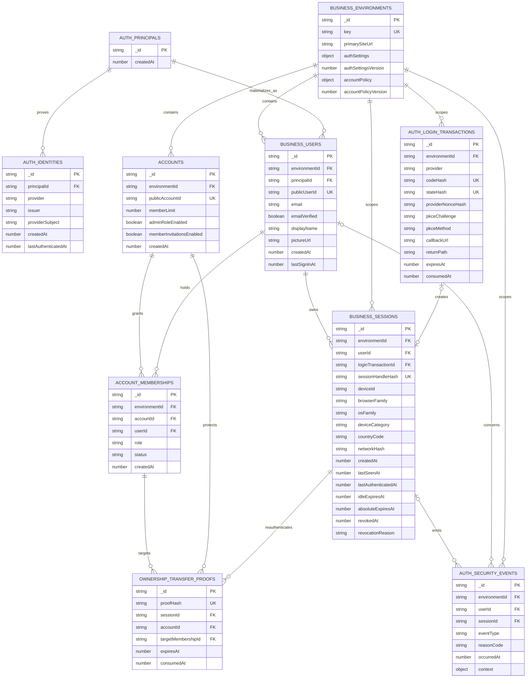

# Brainstorm: Build 2 Shared MVP

> **Status**: Accepted 2026-09-26 — implementation plan created
> **Created**: 2026-09-26
> **Last updated**: 2026-09-26
> **Repository baseline**: `f2e7e6498bf628d97b74696942f512bb36a322d1`

## Context Snapshot

- Build 1 and the development-authentication follow-up are complete in development and production. The operator dashboard uses its own public Google web client and fixed operator allowlist.
- The canonical next stage is Build 2: Business-user Google authentication, environment-local users/accounts/memberships and the first thin BFF SDK paths. The required support conversation is now a separate Build 5 delivery slice.
- TableCards is expected at `https://tablecards-dev.tofler.app` in stable development and `https://tablecards.tofler.app` in production. No TableCards workload or local development port exists yet.
- The repository deliberately did not preselect Convex Auth, Better Auth or another Business-user session mechanism. That choice determines the exact Google callback path and whether a client secret is required.
- Andrew asked what Google OAuth client and URLs he should prepare before the main Build 2 discussion.

## The Idea

Define the shared identity/account/SDK boundary around one retained example caller without prematurely creating credentials for an auth mechanism that has not been selected. Keep Business-user credentials separate from the two-person backoffice and preserve strict separation between development and production. The email-capable support workflow remains mandatory for the overall MVP but is deliberately outside the implementation plan produced from this brainstorm.

### First authenticated-user slice proposed during discussion

Andrew initially proposed a narrower first definition of done within Build 2: one consumer app signs in a real Google user through the shared customer-auth surface, BFF creates or reuses that user's environment-local record and the read-only backoffice shows the resulting user under the correct Business environment. Discussion later expanded this reference slice to include the required account/membership authorization boundary because account selection materially changes the SDK, short-token claims, renewal behavior and multi-tab semantics. Authentication may create the user before onboarding finishes, but normal product access always requires an account membership. The hosted example proves the selected automatic-account path; integration scenarios prove the temporary onboarding-only path and other policy combinations without turning the example into a visible playground. The email-capable support conversation is no longer part of this brainstorm or its implementation plan; the canonical delivery plan assigns it to a separate later build.

### Identity, user, account and membership vocabulary

- **Technical principal**: the BFF-private representation of one person across linked identity providers. Products never receive its internal ID.
- **Provider identity**: one BFF-private provider-qualified proof, such as Google's stable issuer and subject, linked to exactly one technical principal. Matching email never links two identities.
- **Environment-local user**: the person as represented inside exactly one Business environment. The same human receives a different local user ID in Example Development, TableCards Development and TableCards Production.
- **Account**: the customer/workspace and commercial boundary that owns subscription and entitlements. Depending on the Business, product records may be user-scoped, account-scoped or a deliberate mixture; the account does not universally own every record.
- **Membership**: the environment-scoped relationship connecting a local user to an account, including that user's role such as Owner, Admin or Member.
- **Subscription entitlements**: the account's commercial rights, such as enabled features and its seat limit. They belong to the account, not directly to a user or profile.
- **Seat**: one unit of account capacity consumed or reserved for a person/profile. It is not itself a user, role or profile.
- **Profile**: a product-facing persona and preferences inside an account. A profile may be linked to an authenticated membership, or may be account-managed without an independent login, such as a young child's profile.
- **Data scope**: the code-owned Business rule deciding whether a product record belongs to an environment-local user, an account or both contexts. It is distinct from subscription entitlement and membership permission.

One possible first-login bootstrap is:

```text
verified Google identity (private to BFF)
            ↓
private technical principal
            ↓
Example Development local user
            ↓
Owner membership
            ↓
Personal example account
```

This allows one local user to belong later to both an automatically created account and an invited Studio account without duplicating the user or changing Google identity. Automatic account creation is not necessarily a universal authentication responsibility: one Business may create a default single-seat account, another may require the user to create or join an account during onboarding. Every row below the technical auth boundary remains scoped to one Business environment.

## Codebase Context

### What We Have

- Separate Convex development and production deployments.
- Stable backoffice development and production domains, production CI/CD and an existing operator-only Google client.
- Accepted TableCards customer-facing hostnames under `tofler.app`.
- Fixed identity invariants: provider identities stay private to BFF auth; users, accounts and memberships are scoped to one Business environment.

### Constraints

- The backoffice Google client is an operator credential audience and must not become the public Business-user client.
- A Google web client can list several origins. Sharing its public client ID across development and production means a still-valid Google ID token has the same audience in both lanes, but that token proves identity only; BFF authorization and application sessions remain environment-specific.
- Authorized JavaScript origins contain only scheme and host; callback URLs contain an exact path and depend on the selected auth mechanism.
- The local development origin cannot be registered until the TableCards workload and port exist.
- Google OAuth consent branding is configured above an individual client. Whether TableCards shares a Tofler-branded Google Cloud project or receives a product-specific project remains part of the Build 2 discussion.

### Opportunities

- Reuse the existing BFF deployments and stable Tofler domains with the selected shared public customer Google client across lanes, kept separate from the operator client.
- Configure only Google `openid`, `email` and `profile` for the MVP; no Google API access or refresh token is needed.
- Host one controlled Tofler customer-auth page per BFF lane. TableCards navigates there with its public Business-environment key and a relative return path; the page invokes Google Identity Services, submits the resulting ID token to BFF for verification and then returns to the approved TableCards origin.

## Options

### Authentication transport: Google ID token versus authorization-code callback

Both transports can safely establish the same environment-local BFF user and session. The security boundary is not decided merely by choosing the more backend-heavy flow.

- **Google Identity Services ID-token flow**: a controlled Tofler page invokes Google's popup or One Tap, receives a short-lived ID token and submits it immediately to BFF. BFF verifies CSRF protection, signature, issuer, audience, expiry and nonce before issuing its own environment-bound session. This needs authorized JavaScript origins, but no Google client secret or OAuth callback. It is the simpler authentication-only option, although Google credential material briefly exists in controlled browser JavaScript and a popup/prompt or button may be required.
- **Authorization-code redirect flow**: BFF redirects the browser directly to Google; Google returns a temporary code to the registered BFF callback; BFF exchanges it server-to-server and creates its session. This needs exact Google redirect URIs and a deployment secret. It keeps provider token exchange out of browser JavaScript and best supports the desired no-intermediate-page redirect UX, but adds configuration and state handling.

Both options must reject login CSRF, invalid or wrong-audience provider responses, unapproved return destinations and cross-environment session reuse. The decisive question is therefore the desired browser UX and session architecture, not a claim that public users inherently require a different strength of Google identity proof.

Authentication transport must also remain separate from high-risk action authorization. The current backoffice is read-only. If a later operator workflow can refund, transfer or otherwise affect money, Google sign-in alone is not the complete safeguard: the backend must re-check the operator and deployment scope for every action, require explicit confirmation or fresh step-up authentication where appropriate, enforce idempotency and bounded inputs and create an audit record. That future action can justify strengthening the operator session design without implying that the current Google ID-token verification is unsafe for the read-only Build 1 surface.

### Option A: Reuse the backoffice Google client

**Approach**: Add the customer-auth origins to the existing operator client.

**Leverages**: One existing client and consent configuration.

**Constraints**: Mixes an internal operator audience with public Business users and broadens one accepted token audience across unrelated surfaces.

**Effort**: Low

**Risk**: Broad credential blast radius and confusing ownership. Not recommended.

### Option B: One customer-auth client shared by development and production

**Approach**: Create one new web client containing both customer-auth JavaScript origins.

**Leverages**: Fewer Google credentials while remaining separate from the backoffice.

**Constraints**: The same Google token audience crosses both deployment lanes, so BFF must never treat Google identity alone as an environment authorization or application session.

**Effort**: Low

**Risk**: A stolen, still-valid Google ID token could be presented to either lane, although each lane must still create and enforce its own environment-bound session. Selected for the solo MVP because the client ID is public and the simpler setup outweighs this limited identity-bootstrap overlap.

### Option C: Separate customer-auth development and production clients

**Approach**: Create one Google Identity Services web client per lane. Register only that lane's customer-auth JavaScript origin and configure its public client ID in the corresponding auth site and BFF verifier. No client secret or Google redirect URI is used.

**Leverages**: Existing separation of Convex data, Cloudflare workloads and deployment configuration.

**Constraints**: Two clients must be configured and maintained.

**Effort**: Low

**Risk**: Slight setup overhead; an ID token minted for development is not accepted by production. Deferred until observed risk or organizational separation justifies it.

### First consumer option A: Minimal TableCards shell

**Approach**: Create the real TableCards web workload with only the shared sign-in entry, signed-in identity view and sign-out behavior for this slice. Product features arrive later without replacing the caller.

**Leverages**: The canonical MVP already requires TableCards, its stable domains and the BFF SDK boundary.

**Constraints**: The first slice becomes visibly associated with TableCards before its core generator exists.

**Effort**: Low

**Risk**: Lowest throwaway work and clearest path into later builds. Recommended.

### First consumer option B: Retained minimal Business example app

**Approach**: Add a deliberately small, executable generic Business app used as the permanent minimal BFF consumer reference and authentication integration fixture. It signs in against a dummy Business environment, shows only the signed-in local user/session state and remains development/reference infrastructure rather than a customer product.

**Leverages**: Provides a neutral proof that BFF authentication is not coupled to TableCards, gives Codex and future developers the smallest code example to copy or study and remains valuable for SDK regression.

**Constraints**: Adds another maintained Nx workload and documentation boundary. It should demonstrate only stable public BFF/SDK contracts and must not grow into a second product, speculative starter framework or polished public demo.

**Effort**: Medium

**Risk**: The example may drift from the supported SDK or accumulate optional features. Selected, with deliberate minimalism as its purpose.

### First consumer option C: Disposable demo app

**Approach**: Build a temporary dummy site only to demonstrate login and then remove or abandon it.

**Leverages**: Keeps the first visual surface generic.

**Constraints**: Contradicts the repository rule to add only models and surfaces with a real caller and produces no durable product asset.

**Effort**: Low initially, higher overall

**Risk**: Throwaway code, duplicated later work and misleading completion evidence. Not recommended.

### First-login data option A: Create the environment-local user only

**Approach**: Successful Google bootstrap creates or reuses the technical auth identity and exactly one local user inside the selected Business environment. Account and membership creation wait for a real Business onboarding policy.

**Leverages**: Fully proves authentication, per-environment identity and backoffice visibility without preselecting TableCards or another Business's workspace rules.

**Constraints**: The example cannot demonstrate account-scoped product data yet, and the overall Build 2 account/membership work remains unfinished.

**Effort**: Low

**Risk**: A later caller must deliberately handle a signed-in user who has no account until its onboarding flow runs. Initially recommended for the narrow user-only slice; superseded as a final product state when Andrew decided that every usable Business session must have an account membership. It remains valid only as the temporary onboarding state.

### First-login data option B: Always create a personal account and owner membership

**Approach**: Treat personal-account bootstrap as a universal BFF consequence of first sign-in.

**Leverages**: Every authenticated user immediately has an account context, matching many consumer products.

**Constraints**: Invitation-only, shared-account-first or organization-first Businesses may not want this behavior.

**Effort**: Medium

**Risk**: Encodes one Business model into shared authentication and creates unwanted accounts. Not recommended as a universal rule.

### First-login data option C: Add configurable account-bootstrap policies now

**Approach**: Give each Business environment an account-provisioning setting such as automatic personal account, guided create-or-join or invitation-only. Sign-in may first create the user in an onboarding-only state; normal product access begins only after a valid account membership exists.

**Leverages**: Supports multiple onboarding models from the start.

**Constraints**: Requires us to define policies before two real Businesses demonstrate the necessary variants.

**Effort**: High

**Risk**: Premature abstraction and settings that may not fit later products. Defer.

### Account-context option A: One active account in the shared Business cookie

**Approach**: Store one active account and its permissions alongside the durable Business session, replacing it whenever the user switches accounts.

**Leverages**: Keeps all authorization material HttpOnly and gives ordinary APIs a locally verifiable account context.

**Constraints**: Cookies are shared by every tab on the hostname. Switching accounts in one tab silently changes the context used by other tabs.

**Effort**: Low

**Risk**: Cross-tab interference can cause confusing or dangerous actions in the wrong account. Reject.

### Account-context option B: Put every membership in one short JWT

**Approach**: Include a bounded list of all account IDs and roles/permissions in one Business-issued short token. Each request supplies its target account and middleware checks it against the signed list.

**Leverages**: Different tabs can target different accounts without another membership lookup.

**Constraints**: Token size grows with membership and permission complexity, all included permissions become stale together and the authentication transport would impose account-count or encoded-size limits on product policy.

**Effort**: Medium

**Risk**: Convenient for very small bounded memberships but creates a transport-driven Business limitation. Do not select as the universal contract.

### Account-context option C: One short account token per tab

**Approach**: Keep the durable HttpOnly Business session user-scoped. After a tab selects an account, the shared server SDK asks BFF to validate its authoritative membership/account state and issue a ten-minute BFF-signed JWT for exactly that user/account/permission context. The SDK holds it in that tab's memory, renews it automatically and exposes only the verified request context to product code. The previous account is merely an initial preference for new tabs.

**Leverages**: Ordinary APIs verify user, active account and permissions locally and perform only their real account-scoped data query. Two tabs can operate in different accounts without sharing live selection state.

**Constraints**: BFF must own indexed membership/account lookups and deterministic default-selection policy. Each active tab performs a BFF membership check when its context is issued or renewed. The short account token is browser-visible, so it must remain narrowly scoped and short-lived while the durable session handle stays HttpOnly.

**Effort**: Medium

**Risk**: More SDK machinery than a global account cookie, but it removes per-request membership reads without breaking multi-tab use. Selected for account-aware web Businesses.

### Dependent-management option A: Family account with child profiles

**Approach**: The parent is the authenticated Owner of one family account. Children are account-owned profiles or beneficiaries without independent authentication identities.

**Leverages**: One subscription, one payer and simple parental control. It matches products where a child never signs in independently.

**Constraints**: A profile is not an environment-local user and cannot independently own sessions, memberships or identity recovery.

**Effort**: Low

**Risk**: Becomes limiting if the child later needs a portable, independent login and account history.

### Dependent-management option B: Child-owned account with parent management membership

**Approach**: Parent and child are separate environment-local users. The child has a personal account; the parent receives an account-scoped Guardian/Manager capability through membership rather than authority over the child's user identity.

**Leverages**: Existing account membership and per-account permission concepts. The parent can manage the child's product/account state while authentication, sessions and recovery remain separate.

**Constraints**: The product must define who pays, whether the child can remove the guardian and what happens when guardianship ends. A Guardian label may map to Business-specific permissions rather than becoming a universal BFF role.

**Effort**: Medium

**Risk**: Treating guardianship as ordinary Admin access may grant too much or too little authority. Recommended when the child has an independent login.

### Dependent-management option C: Parent-owned child account

**Approach**: The parent owns and pays for a separate account whose beneficiary is the child. The child may have a Member login or may remain only a profile; ownership may transfer later when policy permits.

**Leverages**: Keeps legal/billing responsibility with the adult while separating the child's product data from the parent's personal account.

**Constraints**: “Owner” and “beneficiary” become different concepts and ownership transfer/age-transition rules are product-specific.

**Effort**: Medium

**Risk**: Calling this the child's personal account is misleading until ownership or beneficiary semantics are explicit. Recommended when the adult must remain the payer/legal controller.

### Session handoff option A: Browser SDK exchanges a one-time code

**Approach**: The auth host keeps its own protected BFF session. After Google bootstrap it redirects to the approved Business app with a short-lived, single-use code bound to the Business environment, return destination and a browser-generated PKCE challenge. The app SDK exchanges the code directly with BFF over HTTPS for a short-lived environment credential held in memory.

**Leverages**: Supports static/frontend-only Businesses, Tofler subdomains and future independent domains. The same environment credential can be validated by the Business's own backend and used with BFF APIs, so a product backend participates in authorization without owning Google/session bootstrap.

**Constraints**: Page reload loses the in-memory credential. Renewal must use the protected auth-host session, normally through another bounded exchange or top-level redirect when cross-site cookie rules prevent background refresh.

**Effort**: Medium

**Risk**: Code interception or replay if single-use, expiry, PKCE, environment and return-destination binding are implemented incorrectly. Previously favored for universality; reopened after Andrew clarified that most Businesses have backends and prefers the strongest single web default.

### Session handoff option B: Every Business backend exchanges the code and sets a cookie

**Approach**: Redirect to a callback owned by the Business backend. That backend exchanges the code with BFF and sets its own secure, HttpOnly, same-origin session cookie.

**Leverages**: Keeps the Business credential out of browser JavaScript and fits server-rendered or backend-for-frontend products.

**Constraints**: Requires every Business, including the minimal example, to operate a backend/session bridge and proxy or translate BFF calls.

**Effort**: High

**Risk**: Duplicated session code and security drift unless the callback, cookie, CSRF and renewal behavior comes from one shared, versioned server adapter rather than Business-written session code.

### Session handoff option C: Shared cross-subdomain cookie

**Approach**: Set one cookie for the Tofler domain family and let customer subdomains use it directly.

**Leverages**: Very simple for current `*.tofler.app` products.

**Constraints**: Does not extend cleanly to independent product domains and broadens cookie exposure across sibling subdomains.

**Effort**: Low

**Risk**: Weakens Business isolation and creates a migration trap. Reject.

### Session handoff option D: One protocol with platform-safe adapters

**Approach**: Standardize one BFF authorization-code/PKCE protocol. Every web Business includes the shared server session adapter: its backend exchanges the one-time code, keeps the longer session behind a secure HttpOnly same-origin cookie and supplies a very short-lived in-memory credential only when a direct browser data client such as Convex requires one. Native apps use the same protocol but store their session material in the operating system's secure credential store because browsers cookies do not exist there.

**Leverages**: Gives web applications the strongest practical default, still supports direct reactive backends and mobile clients and keeps protocol/session logic in shared packages rather than each Business.

**Constraints**: Even an otherwise static web app needs a tiny session endpoint/Worker. Platform adapters differ internally, although Businesses do not choose among competing authentication models.

**Effort**: High

**Risk**: More shared infrastructure in the first slice, but lower long-term credential-exposure and per-Business drift. Selected after the backend clarification.

### Session authority option A: Central opaque-session introspection on every request

**Approach**: BFF stores the authoritative Business session. The Business cookie carries only an opaque handle, and the Business backend asks BFF to resolve it for every authenticated product request.

**Leverages**: Immediate central revocation and one source of truth.

**Constraints**: Every product request depends on BFF network latency and availability, even when it only reads Business-owned data.

**Effort**: Low initially

**Risk**: Turns BFF into a synchronous bottleneck and expands outages into otherwise independent products. Not recommended.

### Session authority option B: Long-lived stateless JWT session

**Approach**: Put the durable Business session into a signed long-lived JWT that the Business backend verifies locally with BFF's public key.

**Leverages**: Fast local verification and no session lookup.

**Constraints**: A JWT already issued cannot be reliably revoked without reintroducing a central denylist/version check. Business policy and user suspension changes may remain ineffective until it expires.

**Effort**: Low

**Risk**: A stolen thirty-day bearer credential remains useful too long. Reject for durable sessions.

### Session authority option C: Stateful BFF session plus short JWT assertions

**Approach**: BFF stores the authoritative, revocable auth and Business-session records. The shared server SDK holds one stable opaque session handle behind the host-only HttpOnly cookie and uses a BFF-issued, environment/audience-bound JWT with a ten-minute maximum for local request verification and BFF calls. The SDK refreshes only the short JWT against the durable session when needed.

**Leverages**: Normal Business requests validate locally, central revocation blocks renewal immediately and any already-issued assertion dies within ten minutes.

**Constraints**: Revocation of an already-issued JWT has a bounded delay unless a specific high-risk action performs a fresh central check. The durable handle must be high-entropy, stored only in the protected cookie, hashed at rest and governed by server-side idle/absolute expiry.

**Effort**: Medium

**Risk**: More moving pieces than either extreme, but they live in the shared SDK. Selected because it avoids both per-request BFF dependency and unrevocable long-lived JWTs while keeping all durable session tables in BFF.

### Web integration option A: Run the full session adapter inside every Business backend

**Approach**: Each Business imports the server SDK and exposes the login, callback, renewal and logout handlers itself.

**Leverages**: Works with almost any host or backend and keeps requests directly between the browser and product server.

**Constraints**: Every Business must deploy compatible server routes and upgrade them when protocol behavior changes, even though the code is shared.

**Effort**: Medium per ecosystem

**Risk**: Integration and version drift across many small Businesses. Selected as the universal web path because Andrew prefers the cookie and session boundary to remain explicit in each Business's code rather than in Cloudflare routing. The shared SDK and automated upgrade/testing discipline contain the drift risk.

### Web integration option B: Shared same-origin Tofler session gateway

**Approach**: Deploy one centrally maintained Cloudflare Worker/session gateway on a reserved path or in front of each Business hostname. Because the request still uses the Business origin, the gateway can create and rotate that Business's host-only cookies while calling the central BFF session service. It validates short assertions at the edge and either proxies the request or exposes narrow same-origin auth/session endpoints. Product backends retain only lightweight BFF-JWT verification/current-user middleware; direct Convex clients obtain their short token from the same-origin gateway.

**Leverages**: One deployment updates callback, cookie, renewal, logout and CSRF behavior across the factory. Cloudflare Workers routes can match a path on an existing hostname, take precedence over broader routes and run before a Custom Domain Worker/origin.

**Constraints**: The Business hostname must be proxied/routed through Cloudflare. The gateway must derive the Business environment from a trusted host-to-environment registry, never a caller-supplied parameter, and the product origin must still reject forged identity headers or verify the forwarded JWT.

**Effort**: Medium centrally, low per Business

**Risk**: The shared gateway becomes important platform infrastructure, a bug could affect several Businesses and Cloudflare becomes aware of application-session behavior. Rejected as the default. Cloudflare may host or proxy a Business, but it will not own the authentication protocol or cookie lifecycle.

### Web integration option C: Let the central auth hostname set every Business cookie

**Approach**: Attempt to have `auth.tofler.app` set cookies directly for unrelated Business domains.

**Constraints**: Browser cookie-origin rules prohibit this, and widening cookies to a shared parent still fails for independent domains while weakening isolation.

**Effort**: Not applicable

**Risk**: Impossible or unsafe. Reject.

### Web integration option D: Keep the only durable browser cookie on the BFF auth host

**Approach**: The auth host keeps the renewal cookie. On each page load or token expiry, product JavaScript makes a credentialed cross-origin request to BFF for a short environment JWT, holds it in memory and sends it to the Business backend.

**Leverages**: Only one durable cookie and no same-origin Business cookie/session adapter.

**Constraints**: It relies on cross-origin cookie and CORS behavior. Current `*.tofler.app` products are same-site, but independent product domains become cross-site and browsers may block or partition the BFF cookie. The fallback is a top-level auth redirect on reload/renewal. Business backends still need to verify the short JWT, and exposing token acquisition to product JavaScript broadens XSS and CSRF concerns.

**Effort**: Low for current Tofler subdomains, higher when dedicated domains arrive

**Risk**: Creates a domain-dependent migration trap and gives one central browser credential a broader blast radius. Reject as the universal web contract; retain the isolated Business-host cookie managed by the Business server SDK.

## Proposed Authentication ERD



`AUTH_PRINCIPALS` is the private technical person boundary. Provider-qualified identities belong to it, while each `(environmentId, principalId)` produces at most one environment-local Business user. This avoids merging identities by email and allows a future linked provider without duplicating Business users. Each `(accountId, userId)` has at most one membership and each account has exactly one Owner, enforced transactionally. `userId` and `sessionId` on a security event are optional because a rejected pre-login attempt may have neither. Common query dimensions remain first-class fields; `context` is bounded supplemental evidence rather than arbitrary indexed JSON. Convex indexes support deterministic lookup, while logical uniqueness is enforced transactionally by application code. A separate device table, subscription/plan tables and managed profiles wait for the builds that have real callers.

Ephemeral protocol state has bounded cleanup rather than becoming permanent user history. Consumed or expired login transactions and ownership-transfer proofs are deleted within 24 hours. Expired or revoked session rows and their coarse device/network evidence are retained for 90 days for support and security investigation, then deleted; active rows remain only through their configured absolute lifetime. Ordinary sampled/aggregated security evidence follows the same 90-day ceiling. Ownership-transfer audit events remain for the life of the account because they explain the current ownership chain, then follow account-deletion/legal-retention policy. Raw codes, proofs, JWTs, cookies and provider tokens are never logged or retained.

The accepted user-profile boundary stores Google's stable issuer/subject privately on the authentication identity and copies the verified email, display name and optional picture URL onto the environment-local user for product/backoffice use. Email verification must be true before copying the address. These profile fields refresh on successful sign-in rather than on every request or ten-minute token renewal. Coarse security/session telemetry—browser and OS family, device category, approximate country and keyed network correlation—stays on session/security records rather than becoming profile data. Do not store precise location or permanent raw IP addresses. Read-only backoffice may show the current profile plus last sign-in and coarse session evidence.

The MVP will not build a DDoS-specific telemetry, dashboard or alerting system, and it will not add a Cloudflare proxy or paid Convex custom domain solely for DDoS protection. Public authentication entry points may use the official Convex application rate-limiter component before expensive verification or database work, but rejected flood traffic must not create one durable security event per request. The limiter's bounded bucket state is protection rather than an audit trail. Preserve individual durable events for meaningful authenticated lifecycle and high-risk actions; routine pre-authentication failures remain generic to the user and are sampled or aggregated only if later operations demonstrate a need. Broader error monitoring such as Sentry is deferred and, if adopted, must filter expected denials and secrets so an attack cannot amplify monitoring volume or cost. Such monitoring may reveal failure patterns but cannot reliably establish an attacker's intent.

The account/authentication acceptance suite uses three layers rather than forcing the entire configuration matrix through browser automation. Fast unit decision tables exhaustively cover the four combinations of `createAccountOnFirstSignIn` and `userAccountCreationEnabled`, defaults, numeric boundaries, invalid combinations and pure account-policy rules. A small number of substantial Convex integration scenarios reuse fixture builders and exercise related state transitions together—for example signup/onboarding, account selection/membership capacity, roles, invitations and ownership transfer—while retaining enough separation that a failure identifies its area. Paid-plan, entitlement and restriction transitions belong to Build 4's scenarios. Hosted browser E2E is reserved for the real transport contract: login handoff, callback cookie, renewal, independent tab-local account contexts, logout and cross-environment denial. The hosted example demonstrates one understandable reference path; it is not responsible for visibly representing every configuration combination.

Hosted development also exposes a non-public automated identity-provider entry for Codex and Playwright with two explicit capabilities. `login-dummy` selects or creates a deterministic dummy persona with a stable reserved test subject and bounded test profile data such as a `.invalid` email, display name and optional picture; the same persona resolves to the same technical/environment user, while different persona IDs create distinct users for signup, invitation and authorization scenarios. `login-as` accepts the public ID of any existing user in an explicitly automation-enabled development Business environment—including a user originally created through Google—and establishes an ordinary session with that user's effective development permissions. It does not forge or relink the underlying Google identity. The resulting Business session needs no special impersonation flag or altered lifetime: the security boundary is that only development contains the automation provider, verification configuration and entry route.

Automation provenance is still recorded outside the ordinary session shape as a bounded security event linked to the resulting session, with capability (`login-dummy` or `login-as`), grant ID hash and target public user/persona. That evidence is for development diagnosis and cleanup, not authorization. `login-as` must not update the target user's Google identity `lastAuthenticatedAt`, verified email, display name, picture or other provider-derived profile fields; only a real successful provider sign-in refreshes those values. A dummy persona may update only its own reserved dummy profile.

Both capabilities are initiated only through the protected operator CLI/Playwright fixture interface, never a normal provider button or publicly usable user-picker. A local mode-`0600` private key signs a fresh roughly two-minute, single-use grant containing the exact development environment, capability and persona/target; development BFF receives only its public verification configuration and validates issuer, audience, expiry, unique grant ID and target environment before atomically consuming the grant. The flow then uses the same BFF login transaction, single-use handoff code, Business callback, durable session and authorization path as a human login. In development it may also satisfy the provider-neutral ownership-transfer reauthentication ceremony, but only when the asserted dummy identity resolves to the same principal as the current Owner; a different dummy user is denied. Account membership remains fixture/application state rather than part of the impersonation grant. Tests revoke or clean up automation sessions when practical. Production has no verification configuration or route and must fail its build/deployment guard if automation markers appear. Integration tests may create deterministic dummy people directly; the automated provider is primarily the hosted end-to-end bridge and does not replace one-time real-provider/browser compatibility evidence.

Identity and signup materialization are transactionally idempotent. Provider identity is logically unique by provider, issuer and provider subject; the environment-local user is logically unique by Business environment and private principal; automatic first-account creation is logically unique for that environment-local user. Each get-or-create mutation reads the relevant indexed logical key and inserts only when absent, allowing Convex optimistic transaction retry to make concurrent first logins converge on the same principal, identity, user, default account and Owner membership. A login-transaction code is consumed atomically and can establish at most one Business session; its replay is denied. Two independent valid login ceremonies may create two separately revocable sessions, which is expected rather than a duplicate-user defect. Integration scenarios must race first login and code consumption deliberately and assert these invariants.

## Open Questions

No material direction questions remain. The requested Astra review completed on 2026-09-26 and found the overall direction coherent; its seven material findings and non-blocking consistency items are now reconciled in this artifact, `STATUS.md`, the delivery plan and ADR 0001. The brainstorm awaits Andrew's explicit acceptance before implementation planning.

Native multi-user device storage, parent/child product semantics, additional seat types, usage-based billing and a generalized high-risk-operation policy are explicitly deferred until real callers require them. Ownership transfer already requires recent reauthentication and permanent audit evidence.

The durable, non-authoritative [future architecture ideas registry](../../docs/architecture/future-ideas.md) preserves the cross-provider identity-linking/recovery and usage-based billing/credit concepts for later topic-specific brainstorms. Its entries are context, not accepted scope or permission to implement them. Support is not a deferred idea: it remains required by the canonical TableCards MVP and now has its own Build 5 delivery slot, to be designed after this authentication/accounts direction closes.

## Current Direction

Use the Google Identity Services ID-token flow on a controlled, shared Tofler customer-auth page. Use one Web application client named `Tofler Customer Sign-In` with both `auth-dev.tofler.app` and `auth.tofler.app` as Authorized JavaScript origins; never reuse the backoffice client. Its client ID is a reviewed public identifier shared by both BFF deployments, while its client secret and redirect-URI fields are unused.

The first consumer will be a retained, deliberately minimal example Business app rather than TableCards or a disposable demo. Its purpose is to be executable reference code for the smallest possible BFF-integrated application and a durable authentication/SDK regression fixture. It is not a usable product, public showcase or commitment to a general scaffolding generator. Its initial visible surface should contain only sign-in, signed-in local-user/session evidence and sign-out/error states needed to prove the contract.

The example uses the normal automatic-first-account path. An ordinary first sign-in creates the default account and Owner membership, then enters the app without a separate account-management workflow. The app renders an account selector only when the current user has more than one active membership; otherwise it selects the sole account automatically. Its development configuration permits two total memberships so a fixture can add a selected automation user to a second account and Playwright can prove two tabs retain independent active-account tokens. The example does not expose account creation, invitations, role/seat administration, plan/billing management or a policy playground. `onboarding_required`, the global default one-membership limit and the other policy combinations remain explicit unit/integration scenarios rather than additional hosted examples.

The example has stable addresses in both lanes: `https://example-dev.tofler.app` for development and `https://example.tofler.app` for production. Both remain reference infrastructure: identify them clearly as examples, send no-index directives and do not promote or link them as products. The production counterpart is required acceptance evidence rather than symmetry—Build 2 is not complete until the real Google-authenticated protected flow works there.

The hosted example accepts any valid Google user rather than an operator allowlist. It therefore proves open customer onboarding, not merely internal test access. The example exposes only the signed-in visitor's own minimal session/user evidence; the cross-user list remains available only through the protected operator backoffice. No-index headers reduce accidental discovery but are not treated as authorization.

The first authenticated-user slice now includes account-aware authorization because account context materially affects the stable SDK and session contract. Authentication may initially create only the environment-local user, but that user remains onboarding-only until they own or join an account; normal product access always requires an active account membership. BFF is authoritative for the generic account system: environment-scoped accounts, memberships, fixed roles, account-policy configuration, registered plans and effective shared entitlements live in BFF and are enforced there. Each Business chooses its provisioning and account policy through validated configuration—for example automatic first-account creation, user-created accounts, membership limits, invitations, Admin and ownership transfer—but does not reimplement or separately store that machinery. The Business backend owns only its product-specific records and decides whether those records are user-scoped, account-scoped or mixed. This lets BFF validate the complete current context before signing the shared JWT without trusting account claims supplied by an arbitrary Business backend. The example must exercise at least two accessible accounts for one user so automated evidence can prove that separate tabs retain independent active-account contexts.

The durable HttpOnly Business cookie and short JWT have separate jobs. The cookie contains one stable opaque handle for the centrally stored BFF session and is common across tabs; it contains neither account selection nor a short identity assertion. The handle is newly generated with at least 128 bits of CSPRNG entropy for each successful login, accepted only through the cookie mechanism, stored only as a hash in BFF and kept unchanged during ordinary ten-minute JWT renewal. The current tab holds one BFF-signed ten-minute JWT in memory. Before the user has an account, that token is explicitly onboarding-scoped and authorizes only the allowed create/join/invitation, recovery and sign-out paths. After the SDK selects and validates an account, it asks BFF to issue an account-scoped replacement token bound to the exact environment, audience, user, session, account and membership. BFF is the sole token signer, and both the Business backend and shared BFF APIs verify the same issuer/public key. One tab may therefore use Account A while another uses Account B without sharing account choice through the cookie.

The account-scoped BFF JWT is the hot-path authorization snapshot. In Build 2 its compact signed claims carry the fixed account role/permission scopes needed by frequent APIs. Token issuance or renewal resolves the authoritative BFF membership and account state roughly once per ten minutes of active use; ordinary Business and BFF API calls verify the same token locally, then query only their actual product/capability data under the signed identifiers. They do not join identity, user, membership and account tables on every request. Build 4 extends this same versioned context with the effective account/seat product entitlements its real paid flow uses; dynamic usage counters, seat mutations, billing operations, current suspension state and other immediately consistent or high-risk facts still require authoritative transactional reads. Effective entitlements may then be denormalized onto the BFF account as a versioned runtime snapshot so issuance does not traverse billing history; detailed subscription/payment records remain the commercial source of truth. A Business backend may request a token but never supplies trusted account claims or signs a token that shared BFF services accept.

Multiple remembered people on one native device are a separate feature from one user accessing multiple Business accounts. A native app may store several independent opaque renewal credentials in operating-system secure storage, one per environment-local user session, and keep only non-secret labels for its account chooser. Each person authenticates separately; choosing a remembered person activates that person's session, after which account selection works normally inside that user. Revocation and logout remain per session, with an explicit remove-all option. Cookies, browser CORS and browser CSRF mechanics do not apply to this native storage adapter. The web reference slice does not need to implement a multi-user device chooser, but the central session model must not assume only one session may exist per physical device.

Andrew's initial account-settings list is a draft, not an accepted contract. It contains the right controls, but `allowAccountlessSignup` combines two decisions and “member of” is ambiguous because an Owner is also a membership. The recommended cleanup separates stable Business policy from subscription-driven account entitlements.

Recommended Business-environment account policy:

- Account membership is a platform invariant for normal product access, not a configurable `accountMode`. A newly authenticated user may exist temporarily without a membership, but may access only onboarding and sign-out until provisioning finishes.
- `createAccountOnFirstSignIn`, default `true`: whether first sign-in automatically creates an account and Owner membership using the Business environment's active account-policy defaults. Businesses needing organization details, managed provisioning or invitation-first onboarding explicitly set it to `false`. “Personal” and “team” are not structural account kinds in the shared model.
- `userAccountCreationEnabled`, default `false`: whether an ordinary authenticated user may create an account and become its Owner. This is deliberately independent of automatic account creation, so all four combinations are valid. A Business enabling it should also set compatible owned-account and total-membership limits. Until a first membership exists, the authenticated user is explicitly `onboarding_required`: they have a durable session and a narrowly onboarding-scoped short JWT with no account claims, and may access only permitted create/join/invitation onboarding, recovery and sign-out. No temporary account is created and later deleted.
- `maxAccountMembershipsPerUser`, default `1`: total accounts the environment-local user may access, including accounts they own. A Business that wants a user to retain an automatically created account while joining a team must deliberately raise this to at least `2`; invitation acceptance fails safely when the user is already at the limit.
- `maxOwnedAccountsPerUser`, recommended default `1`: owned accounts are a subset of total memberships, so this value must not exceed `maxAccountMembershipsPerUser`.
- `ownershipTransferEnabled`, default `false`: whether the sole Owner may transfer ownership to another existing active member. When enabled, transfer requires reauthentication through any currently enabled provider already linked to the same private principal, plus explicit confirmation. Matching email alone or an unlinked provider is never sufficient. BFF issues a single-use proof valid for at most five minutes and bound to the current session, account and intended replacement Owner; the atomic transfer consumes it, preserves exactly one Owner and produces permanent audit evidence. The previous Owner becomes Admin when the Admin role is enabled, otherwise Member; a pending invitation can never receive ownership directly. Development's dummy provider exercises this same contract for the current Owner, while production contains no dummy-provider trust path.

Recommended active-account capability defaults. Build 2 sources these from the Business environment or an explicit account override; Build 4 later allows a registered subscription plan to produce the same effective fields:

- `seatLimit`, default `1`: total occupied account seats, explicitly including the Owner. A pending invitation should reserve a seat so concurrent acceptance cannot exceed the limit.
- `adminRoleEnabled`, default `false`: whether the fixed limited Admin role is available for the account. When enabled, an Admin may invite, remove and update ordinary Members, but cannot manage the Owner, assign/remove other Admins or transfer ownership.
- `memberInvitationsEnabled`, default `false`: whether this account may create membership invitations. It is independent of how the current user obtained or created an account, so a user with an automatically created account may still accept invitations from other accounts. A Business default or explicit account override must deliberately enable it in Build 2, normally alongside a seat limit greater than one; Build 4 may also derive it from a registered plan. The inviter must also have the required account role/capability, the invited user must remain within their total membership limit and the account must have seat capacity.

The shared account model has no `personal | organization | team` kind. Those labels describe the account's current subscription and effective entitlements. The same account may move from a single-seat plan to a team plan without changing its ID, memberships or product-data ownership. A plan change may increase seat capacity and enable invitations or Admin without creating a second account. Billing decides the commercial adjustment—such as crediting unused time and charging the new plan difference—while authorization consumes only the resulting effective entitlements.

Business account policy should be configured through a guided Codex skill backed by the validated operator CLI, not by asking the developer to memorize field combinations or by adding a large backoffice form. The skill asks one scenario question at a time—for example what happens after first sign-in, whether users may create additional accounts, how many they may own or join, whether invitations/Admin are enabled and whether ownership may transfer. It uses concrete product examples, recommends conservative defaults, explains the consequences, rejects contradictory combinations and shows the exact resulting configuration for confirmation before applying it. The read-oriented backoffice should display the effective policy and its source (Business default or explicit account override in Build 2, with registered subscription plan added in Build 4), while repeatable writes remain in the skill/CLI path until a recurring human-only workflow justifies a web control.

The family-plan interpretation is therefore: the Account owns the subscription and receives (for example) six seats; each seat assignment consumes one unit for an authenticated membership, an account-managed profile or a pending invitation that reserves future capacity. Membership answers who can enter and what they may administer. Profile answers whose personalized experience/data is being used. A common adult member may have one membership, one linked profile and one occupied seat, but those concepts remain separate because a managed child profile can occupy a seat without having a login and an invitation can reserve a seat before either a membership or profile exists. A seat assignment may be represented explicitly once managed profiles exist; until then, occupied/reserved seat usage can be derived transactionally from memberships and invitations without prematurely adding an empty table.

Role, account entitlements and per-member product entitlements are independent. Role (`Owner | Admin | Member`) governs account administration. Build 2 treats every active membership as consuming one standard unit of the account's configured `seatLimit`; it adds no separate seat-assignment table or paid seat type. Build 4's effective plan may later govern account-wide features/capacity and add real seat types whose entitlement bundle governs a member's product access or usage allowance. An Admin with a standard seat may then manage members without receiving premium product features; a Member with a premium seat may use those features without gaining administrative authority. A requested voluntary downgrade succeeds only when the account already satisfies the target plan's limits; otherwise BFF rejects it and reports what the Owner must change first. It never silently removes or deactivates members to make the request fit.

Do not overload “permission.” Four independent questions exist: account subscription entitlement asks which paid features/capacity the account has; optional seat entitlement asks which paid product access/usage this member receives; membership role asks what the user may administer in that account; data scope asks whether a particular record belongs to the user, the active account or both. A single-user Business may key almost all product data by `userId` and use its one-seat account only for billing entitlements. A team Business keys shared records by `accountId`. A mixed Business can keep personal preferences/history under `userId` and collaborative resources under `accountId`. This is a code/schema decision for each Business, not a switch that operators should change after data exists. The authenticated request context supplies the verified IDs, role, effective account entitlements and seat entitlements needed for product code to choose the correct scope without another identity lookup.

The fixed MVP roles are Owner, optional limited Admin and Member. Every account has exactly one Owner. A Member cannot manage memberships. `adminRoleEnabled` defaults to false; when enabled, an Admin may invite, remove and update ordinary Members but may not manage the Owner, assign/remove other Admins or transfer ownership. The Owner controls Admin assignment and, when enabled, ownership transfer. Broader peer-Admin management or granular custom roles are outside the MVP rather than implied by “Admin.”

Limits are enforced transactionally when an account is created, joined, invited, transferred or changed; hiding UI controls is never the security boundary. Effective account entitlements, including invitation capability, should use one deterministic precedence order—explicit account override, then subscription-plan entitlement, then Business-environment default—and remain within platform/business safety bounds. If a subscription expires, payment fails or another unavoidable commercial transition leaves the account outside its valid limits, BFF preserves every user, membership and product record but restricts ordinary product access. The Owner and enabled Admins retain only the remediation-safe access needed to restore payment, reduce membership/usage or otherwise bring the account back into compliance. Successful remediation returns the account to active. Do not add automatic seat selection, member removal or downgrade scheduling.

Commercial restrictions do not invalidate identity or the durable login session. Build 4, together with the first real subscription caller, will add BFF's signed account-access mode and reason, such as `active` or `restricted` with `subscription_expired`, `payment_failed` or `manual_suspension`, plus the server-SDK guards that deny ordinary product operations while permitting explicitly declared Owner/Admin remediation routes. Build 2 implements only the active account path and does not ship unused restriction states or guard machinery. Once Build 4 adds the real flow, a newly effective restriction may leave an already issued active JWT usable for at most its remaining ten-minute lifetime; immediately sensitive billing operations must check authoritative current state.

Usage-based billing is a deferred extension, not part of this first implementation slice. Conceptually it remains separate from subscription/product entitlements: entitlements answer whether a feature is available, while an account-owned usage ledger answers how much was consumed and whether more spending is permitted. A future Business registers named meters and its backend—not browser JavaScript—uses an idempotent reserve/commit/release SDK flow around billable operations. Mutable balances and spending limits stay authoritative in BFF rather than in ten-minute JWTs. Prepaid credits are the recommended first real caller because they limit unpaid/runaway cost; postpaid metering waits for an explicit Business requirement. Do not add meter, balance or usage-ledger tables in the current auth/account slice.

Subscription plans and product entitlements are a Build 4 capability, implemented only with the first real Paddle caller. At that point they become authoritative after versioned Business registration through the guided configuration skill/operator CLI. A plan has a stable internal ID, optional trusted payment-provider price mappings, shared account/seat entitlements, a bounded Business-defined product-entitlement object validated against the Business's registered schema and an optional default-plan designation. Payment events carry provider product/price identity only; BFF verifies and maps that identity to the pre-registered plan and never treats payment metadata or browser input as authorization configuration. The SDK then exposes the resulting effective plan and validated product entitlements to Business code. Build 2 implements account/membership policy, fixed roles, invitations, ownership transfer and the active account context, but adds no plan/subscription tables, product-entitlement engine or restricted-account guards.

Every Business uses one supported authentication protocol: the shared auth host redirects back with a short-lived, single-use, PKCE-bound code tied to the exact Business environment and approved return destination. Products do not implement Google integration or inspect provider/BFF token internals. Shared client/server adapters expose a small stable facade such as sign-in, current session/access-token supply and sign-out.

The environment credential also authenticates the user to a Business's own backend. Shared server middleware validates the BFF issuer/signature, exact Business-environment audience, expiry and environment-local user subject before product code reads or writes its own data. A Business backend can forward the same user credential when calling BFF on that user's behalf. Server jobs acting without a user continue to use the separately accepted environment-scoped service credential. This preserves one identity/session contract while allowing Businesses to keep product-specific data in Convex, PostgreSQL, Supabase or another backend.

The selected web delivery keeps the entire Business-side authentication boundary in application code, not in Cloudflare configuration or a shared edge gateway. Every web Business runs the Tofler server SDK in its own backend. The SDK terminates the one-time code, owns the Secure HttpOnly session-handle cookie, obtains or refreshes the current short BFF-signed JWT and exposes its verified context to Business code. Cloudflare may provide DNS, TLS and static hosting, but it does not interpret the session, inject identity or own the cookie lifecycle. The same server SDK contract can run in Convex HTTP, Node, Next.js or another supported backend without changing the BFF protocol or product-facing API. The retained example selects Convex HTTP because most Tofler MVPs are expected to use Convex. Each lane initially uses its deployment's free generated `*.convex.site` HTTP URL, a host-only `Secure; HttpOnly; SameSite=None` Business cookie, exact allowlisted credentialed CORS and CSRF/origin checks from its matching `example[-dev].tofler.app` origin. Build the complete adapter and example on that topology before the real Safari acceptance check; do not insert an early cookie-only spike. Automated Playwright checks run Chromium and WebKit against hosted development and assert cookie creation, authenticated cross-origin use, renewal and logout, but Playwright WebKit is not treated as proof of the complete Safari browser privacy policy. If real Safari with normal privacy settings withholds the cookie, the required fix is the Business-owned Convex custom domain rather than a new Cloudflare authentication proxy; update routing/origins/cookie topology behind the same SDK contract, rerun the gates and do not call the build complete until production works. Native apps use the same code/PKCE protocol with operating-system secure storage. These are runtime implementations of one contract, not Business-selectable authentication modes.

Build 2 acceptance is production-backed. Unit decision tables and Convex integration scenarios must pass, including policy combinations, races, replay, authorization and cross-environment denials. Hosted development must pass repeatable Chromium/WebKit flows through the automation provider for login, protected backend access, renewal, logout and independent two-tab account selection; the development backoffice must show the expected environment-filtered user/account state. The reviewed commit must then deploy the shared BFF/auth/example code to production, where automated smoke proves the public and signed-out boundaries, the automation provider/configuration is absent and cross-lane credentials fail. Finally, Andrew uses real Safari at `example.tofler.app` to complete Google sign-in, load the protected user/account view, hard-reload back into the same session, make a protected request after the first ten-minute JWT has expired, open a second tab successfully and sign out so neither tab can mint another JWT; he also verifies the production backoffice shows the correct environment-local records. Until that complete production lifecycle passes, the build remains incomplete.

For the TypeScript/JavaScript MVP, publish one SDK package with hard browser/server subpath boundaries, for example `@tofler/bff-auth/browser` and `@tofler/bff-auth/server`, plus shared contracts. The browser entry owns sign-in navigation, signed-in state, CSRF attachment and sign-out. The server entry owns the portable same-origin adapter: callback/code exchange, HttpOnly/Secure/SameSite cookie defaults, CSRF/origin enforcement, durable-session lookup and JWT renewal, BFF signature/environment/audience verification and authenticated request context. Every web Business mounts these handlers in its own backend code. Package exports and bundle tests must prevent server-only code or dependencies from entering browser output. Framework adapters appear only for real callers, beginning with the minimal example's actual backend runtime; additional runtimes wait for real Businesses. Businesses configure their public environment key and approved URLs, mount the provided adapter/middleware and consume the resulting local-user context; they do not write authentication protocol or cookie code. A frontend-only product still needs the smallest supported server adapter because the durable session handle must never move into browser JavaScript. Product-specific authorization remains the Business backend's responsibility. A future non-JavaScript Business may receive another SDK implementation of the same wire protocol when a real caller requires it; do not build it now.

The same package should expose a React binding, for example `@tofler/bff-auth/react`, because the first real callers use React. It owns the provider/context, current-user/session loading state, sign-in/sign-out actions, protected-content boundary and finished accessible sign-in/sign-out components. The Business supplies environment configuration and chooses where the component appears, but does not redesign the Google sign-in control. The SDK provides one Google-compliant default with only a small set of safe presentation options such as supported size, width and light/dark treatment. Its wording, provider logo, interaction states, accessibility and behavior remain centrally maintained. Do not ship a complete generic product login page or design system; the shared `auth*.tofler.app` page owns the central provider UI, while each product remains visually its own Business around that control.

Allowed identity providers are a validated Business-environment policy owned by BFF settings, not a choice hard-coded independently in product UI. The shared auth page and React binding read that public policy and render only the configured provider controls, while the BFF also enforces the same allowlist during authentication so hiding a button is never the security boundary. Provider configuration belongs in the Codex/operator CLI and is visible read-only in backoffice; it is not a product-user control. The first slice implements only Google and records `google` as the only allowed provider. A future developer-focused Business could add GitHub without forcing unrelated Businesses to display or accept it, but additional providers and cross-provider identity linking remain future work.

The first slice has one durable browser session per Business environment and no durable central BFF/SSO cookie. The shared auth host may use short-lived transaction cookies for nonce/CSRF protection during the login ceremony, but it does not retain a second user session. This keeps the Business session as the single complete application login for both product data and shared BFF capabilities. A future cross-Business SSO requirement may add an auth-host identity session deliberately; it is not needed for Google-only MVP authentication and must not be smuggled in as a second partial login.

All durable Business-session rows live centrally in BFF; Businesses do not add session tables. After BFF returns a platform-owned, single-use one-minute code, the Business backend's server SDK exchanges it for a newly generated opaque session handle, sets that handle in a Secure, HttpOnly cookie for the exact Business environment and obtains the initial short BFF-signed JWT for the current onboarding/account context. The cookie lives for the configured durable Business-session window—not merely ten minutes—and never exposes its handle to product handlers or browser JavaScript. The short JWT is returned through the SDK to the initiating tab's memory rather than becoming a second durable cookie value. Caller-supplied identity headers are ignored.

When the short JWT approaches its ten-minute expiry, the adapter sends the opaque cookie handle and requested current account context to BFF over server-to-server HTTPS. BFF hashes and resolves the handle, checks environment, idle/absolute expiry and revocation, revalidates the applicable onboarding/account authorization and returns one replacement JWT while leaving the cookie handle unchanged. Concurrent tabs can therefore request different account-scoped JWTs without invalidating one another, a lost response is safely retried and a late renewal response cannot overwrite a logout-cleared cookie. Logout or revocation invalidates the central session row, so the stable handle immediately stops minting new JWTs; a JWT issued just before revocation retains only its already accepted maximum ten-minute life unless a high-risk operation performs a current-state check. This background renewal does not navigate the browser or repeat login. A redirect through the auth host is needed again only after the durable session expires or is revoked. No provider credential or unbounded reusable BFF access token is stored in the cookie. The same technical person still receives separate environment-local users and sessions.

JWT issuance and renewal are server-SDK operations, not public browser-to-BFF calls. The browser interacts only with the Business backend's same-origin SDK route; that server route reads the HttpOnly handle, calls BFF and returns the bounded short JWT to the requesting tab without normally rewriting the cookie. Product JavaScript never receives the session handle or a credential that can independently mint tokens. Once issued, the browser may present the short JWT as a bearer credential to the Business backend or an allowed shared BFF API, and both validate the same BFF signature and exact claims.

A short access token is not a second session. It is the tab-local current-context credential used by both the Business backend and allowed shared BFF APIs, while the durable cookie exists only for the Business server SDK's callback, renewal and logout routes. The browser SDK attaches the BFF-signed JWT to ordinary protected API calls; those APIs never treat the automatically attached cookie as sufficient account authorization. The browser-visible JWT remains platform-owned with a fixed ten-minute maximum lifetime, limiting the useful life of a copied token. While the durable server session remains valid, the SDK renews it silently when required, including after connectivity returns, so an active user is not interrupted. A Business environment may configure the durable Business-session idle and absolute timeouts through validated settings. The default is seven inactive days and thirty total days. Idle may range from fifteen minutes through thirty days; absolute lifetime may range from one hour through 180 days; idle must be positive and no greater than absolute lifetime. The CLI owns changes and backoffice shows the effective policy read-only. Products cannot extend the one-minute code or ten-minute JWT lifetimes. Sign-out and operator revocation invalidate the relevant server session immediately regardless of configured duration. Ownership transfer uses the selected provider-neutral reauthentication proof; other future high-risk operations choose their own fresh-state checks only when a real caller requires them.

Normal sign-out revokes the current Business session and clears its cookie. A later explicit “sign out everywhere” action can revoke every BFF Business-session row for the technical identity; stale cookies on other domains then fail at their next renewal. Neither operation attempts to sign the person out of Google itself.

For ordinary shared capabilities, the preferred web request path is browser to the Business backend with the short current-context JWT, server SDK to product code with a trusted verified context, then Business backend to BFF with that same signed user credential when it invokes a shared capability. Explicitly exposed low-risk BFF browser APIs may accept the same JWT directly with exact CORS; the cookie is never sent to BFF. For example, a support request reaches the environment-scoped support API with the authenticated local user/account context; a payment request reaches the billing API only after the Business backend supplies trusted product/amount context and BFF applies its own billing authorization and idempotency. The user credential proves the actor and environment but never substitutes for capability-specific validation. The SDK reuses the short credential until expiry and renews it from the durable session, so product code does not manage tokens.

Routine authentication changes belong behind the shared auth host, BFF and backward-compatible SDK contract so existing Businesses do not need edits. No client architecture can guarantee that a future incompatible security correction never requires a coordinated SDK upgrade; when that genuinely occurs, use versioned compatibility and automated repository updates rather than maintaining multiple permanent authentication modes.

The preferred browser flow is:

```text
Business UI
  → Business backend /_tofler/auth/login
  → Tofler auth page
  → Google prompt/popup
  → BFF verification
  → exact Business backend /_tofler/auth/callback?code=...
  → session adapter exchanges code and sets Business cookie
  → 303 redirect to the clean Business UI URL
```

The thin product SDK can expose a shared `ContinueWithGoogle` component or login-link builder. On the user's click, the browser first navigates to the Business backend's session adapter. The adapter creates the PKCE verifier/challenge and short login-transaction state, then redirects to the approved Tofler auth-page URL with the public Business-environment key, challenge and relative UI return path. The auth page loads Google Identity Services, attempts the appropriate prompt and retains a visible Google button as a browser-compatible fallback. It receives the short-lived Google ID token only in memory and submits it immediately to BFF. The product itself does not load Google's JavaScript SDK, receive a Google ID token or implement provider callbacks.

A concrete product-facing URL shape is:

- development login start: `https://<example-development-deployment>.convex.site/_tofler/auth/login?returnPath=/`
- future production login start: the relevant Business backend URL, initially its generated `*.convex.site` address when using Convex

The shared `auth` host belongs to the customer-facing Tofler domain family and can serve more than one Business environment. The public environment key selects a configured isolation boundary; it is not an authorization credential. Prefer an allowlisted relative `returnPath` combined with the environment's configured primary site URL over accepting an arbitrary full return URL from the browser.

The Business server SDK starts each login with a cryptographically random protected `state` value and PKCE verifier, retains the verifier only in a short-lived Secure HttpOnly transaction cookie keyed to that attempt and sends only the S256 challenge to BFF. BFF records an independent login transaction bound to the exact Business environment, registered callback, state/challenge and a fresh provider nonce. The auth page passes that nonce to Google Identity Services; BFF verifies the returned ID token's signature, issuer, exact per-lane audience, expiration and nonce before issuing the platform handoff code. The final handoff code remains single-use, one minute long and bound to that same environment, callback and challenge. The Business callback must present the matching state, transaction cookie and verifier, and BFF consumes the code atomically. Independent attempts use independent transaction cookies so concurrent logins do not overwrite one another; swapping a state, code, verifier, nonce, environment or callback between attempts fails, as does replay. BFF never infers Business identity or cookie scope from `Origin`, `Referer` or another caller-controlled URL: registered environment configuration and the bound transaction select the exact callback. The callback is a Business-backend route supplied by the server SDK, not a React route: it exchanges the code for session material, sets the host-only backend cookie and immediately redirects to the registered clean UI destination. BFF returns session material but never attempts to set the unrelated Business-backend cookie. Product JavaScript never reads the code, verifier or provider/session credential. The callback response is non-cacheable, uses a no-referrer policy and redacts its query from application logs. BFF never puts a reusable session token in the return URL.

Knowing another Business's public environment key does not grant access. If App A starts login using App B's key, BFF still returns the code only to App B's exact registered callback; App A has no code to combine with its PKCE verifier. Codes, opaque session handles, BFF-signed short JWTs and service credentials are each bound to one environment, and every backend/API validates that binding. Host-only cookies prevent sibling domains from reading or overwriting one another. Isolation tests must prove that App A cannot exchange App B's code, renew App B's session, present an App A token to App B or read App B data even if App A is fully compromised.

The expected stable JavaScript origins are:

- development: `https://auth-dev.tofler.app`
- production: `https://auth.tofler.app`

Authorized redirect URIs remain empty. A local origin remains deferred until the local customer-auth workflow demonstrates a need for one.

## Decision Log

| Date | Decision | Context |
| --- | --- | --- |
| 2026-09-26 | Treat the operator client and future Business-user clients as separate credential boundaries. | The operator client serves two fixed allowlisted people, while TableCards will authenticate public users and likely require a server-side OAuth secret/callback. |
| 2026-09-26 | Do not ask Andrew to create the client before the auth mechanism is selected. | The stable product origins are known, but the exact callback URL and secret placement depend on the Build 2 auth adapter. |
| 2026-09-26 | Prefer a redirect-only BFF login entry with no intermediate BFF page. | Andrew expects the product to send the browser through BFF to Google immediately. This keeps Google callbacks centralized per BFF deployment while allowing BFF state to remember the Business environment and approved product return URL. |
| 2026-09-26 | Use `auth-dev.tofler.app` and `auth.tofler.app` as the shared customer-auth hosts for their respective BFF lanes. | A stable Tofler auth host is clearer than exposing Convex deployment names, remains separate from the operator-only `.tech` surface and can serve multiple Business environments through validated environment configuration. Exact route paths remain provisional until the auth mechanism is chosen. |
| 2026-09-26 | Select Google Identity Services ID-token bootstrap with Authorized JavaScript origins and no Google callback or client secret. | It is secure for authentication when BFF verifies the complete token contract, matches the simpler proven backoffice model and lets the controlled Tofler auth page centralize provider-specific browser code. This supersedes the earlier redirect-only callback preference. |
| 2026-09-26 | Use one shared customer Google client ID for development and production. | The client ID is public and only establishes Google identity; BFF sessions and authorization remain isolated by Business environment. This favors solo-MVP simplicity over separate Google token audiences and supersedes the earlier two-client recommendation. |
| 2026-09-26 | Use a retained minimal Business example app as the first BFF consumer. | Andrew wants durable code showing the smallest possible application, not a throwaway demo or prematurely branded TableCards shell. It remains a reference/integration fixture and deliberately excludes real product functionality. |
| 2026-09-26 | Give the example app a stable hosted-development address, with no production counterpart yet. | Superseded later on 2026-09-26 by the production-backed completion rule. The development surface remains explicitly non-product and non-indexed. |
| 2026-09-26 | Allow any valid Google user to sign into the hosted example. | The example should prove the same open identity bootstrap expected by customer products. It contains no valuable product capability, exposes only the current visitor's own minimal state and keeps the complete user list operator-only. |
| 2026-09-26 | Create only the environment-local user during this first slice; defer accounts and memberships. | Account bootstrap differs by Business: consumer, invitation-only, multi-workspace and user-centric products need different policies. Shared authentication must not force one account model. |
| 2026-09-26 | Support one browser-auth path across all Businesses: PKCE-bound one-time code exchange through the BFF client SDK. | Andrew prefers one secure standard rather than per-Business session choices and wants central changes to avoid repeated product work. Provider and session mechanics stay behind a stable, backward-compatible SDK facade. |
| 2026-09-26 | Reopen where the one-time code terminates; prefer a shared server session adapter for web Businesses. | Andrew clarified that most Businesses own backends and values the strongest standardized choice. HttpOnly same-origin cookies better protect the longer web session, while direct Convex clients may still receive a very short-lived in-memory access token and native apps require OS secure storage. |
| 2026-09-26 | Mandate the shared server-session adapter for web Businesses and expose it as one BFF authentication SDK family. | Every Business should consume reviewed library behavior rather than implement OAuth, PKCE, cookies, CSRF or renewal. Browser and server entry points remain technically separate to preserve the secret boundary while presenting one supported integration contract. |
| 2026-09-26 | Package the MVP browser and server adapters as one TypeScript/JavaScript package with separate subpath exports. | Both current sides use the same ecosystem, so one versioned package keeps protocol/types aligned. Export and bundle boundaries—not separate publication—keep server code out of browsers. Other-language SDKs wait for real callers. |
| 2026-09-26 | Include shared React auth bindings and a finished Google-compliant sign-in component in the SDK package. | Businesses should not rebuild or restyle a nearly identical provider button. They choose placement and a few supported presentation variants; the SDK owns wording, logo, behavior, accessibility and states without becoming a generic product design system. |
| 2026-09-26 | Make allowed identity providers a BFF-enforced setting per Business environment; implement only Google in the first slice. | Provider relevance differs by Business. The SDK renders the configured choices, but BFF enforcement prevents UI manipulation from enabling an unapproved provider. Configuration is CLI-managed and read-only in backoffice; new providers and identity-linking rules are deferred. |
| 2026-09-26 | Keep one-minute exchange codes and ten-minute browser access tokens as fixed platform limits; make durable-session idle and absolute timeouts validated Business-environment settings. | Businesses have different usability and risk needs, but they must not weaken the short-lived protocol credentials. The default durable policy is seven inactive days and thirty total days, configured by CLI and shown read-only in backoffice. |
| 2026-09-26 | Let each Business environment choose numeric idle and absolute session durations within central safety bounds; named presets are optional convenience only. | A sensitive Business may choose a short session while a low-risk product may keep users signed in much longer. The platform validates the relationship and bounds rather than forcing every Business into one policy or a fixed preset name. |
| 2026-09-26 | Set durable-session bounds to 15 minutes–30 days idle and 1 hour–180 days absolute, with a 7-day/30-day default. | Idle must not exceed absolute lifetime. The one-minute exchange code and ten-minute short assertion remain fixed platform limits for every Business. |
| 2026-09-26 | Use separate host-only secure cookies for the BFF auth session and each Business-environment session. | Superseded later on 2026-09-26 by the one-durable-Business-cookie decision. This earlier direction explored central SSO continuity before the discussion established that the Business session alone authorizes product and shared BFF capabilities. |
| 2026-09-26 | Terminate the one-time handoff code in the Business server callback, then redirect to a clean UI URL. | The Business server SDK performs code exchange and cookie creation. React never receives auth codes or credentials, and the callback URL is exact, non-cacheable and query-redacted. |
| 2026-09-26 | Keep all durable session records in BFF; Business backends remain stateless about sessions. | The Business server SDK keeps only the opaque session handle in its HttpOnly cookie, obtains the current BFF-signed JWT server-to-server and validates that token locally. This avoids both per-request introspection and per-Business session tables. |
| 2026-09-26 | Use one central auth-host identity/SSO session per browser/device and deployment lane, linked to separately revocable Business sessions with independent natural lifetimes. | Superseded later on 2026-09-26. It introduced a second durable login state that was unnecessary for the Google-only MVP and made shared BFF capability access harder to explain. |
| 2026-09-26 | Treat the central auth-host cookie only as an identity/SSO session; the Business-environment session is the complete application login. | Superseded later on 2026-09-26 by deferring the central SSO session entirely. The still-valid part is that the Business session is the complete login and authorizes shared BFF capabilities. |
| 2026-09-26 | Defer a durable central auth-host/SSO cookie; use only short-lived login-transaction state plus the durable Business session. | The Business session is sufficient for product data and shared BFF capabilities. This removes a confusing second login state while preserving the option to add deliberate cross-Business SSO later. |
| 2026-09-26 | Keep the same-origin session adapter in every Business backend's code rather than a shared Cloudflare authentication gateway. | Cloudflare may host or proxy a product but must not understand or manage its authentication cookie. The server SDK owns callback, cookie, JWT verification, renewal and logout, which keeps the protocol portable to future non-Cloudflare products. |
| 2026-09-26 | Use Convex HTTP as the retained example Business backend runtime. | Most Tofler MVPs are expected to use Convex, so the reference integration should prove that common path rather than introduce a different backend merely for authentication. |
| 2026-09-26 | Try the free generated `*.convex.site` backend first with credentialed CORS and a host-only `SameSite=None` cookie. | Andrew has used this standard cross-origin cookie pattern successfully elsewhere and does not want to pay for Convex Pro before an actual incompatibility exists. Real Chrome and Safari compatibility is part of implementation acceptance. The initial fallback list included a Worker proxy, but the later accepted decision narrowed an observed cookie failure to a Business-owned Convex custom domain behind the same SDK contract. |
| 2026-09-26 | Automate the generated-domain cookie flow with Playwright in hosted development. | Chromium and WebKit checks will prove the repeatable login/session path, but WebKit automation does not replace one initial confirmation in the real Safari browser with its full privacy policy. |
| 2026-09-26 | Keep the shared BFF assertion limited to authentication; leave accounts and permissions to each Business domain. | Superseded later on 2026-09-26 by the single current-context JWT. A pre-account token remains onboarding-scoped, while the normal token carries one active account context and is BFF-signed for use by both Business and shared BFF APIs. |
| 2026-09-26 | Expand the first reference slice to prove optional account/membership authorization. | Account selection changes the SDK, short-token and renewal contracts enough that deferring it would leave the authentication design incomplete. The example owns the policy; accounts remain optional rather than a universal result of sign-in. |
| 2026-09-26 | Use one tab-local, ten-minute BFF-signed authorization JWT per active account rather than one account selection in the shared cookie. | Cookies are shared across tabs. Tab-local account contexts let concurrent tabs use different accounts, avoid per-request membership queries and keep only the durable opaque session handle in the HttpOnly cookie. The same token is accepted by the Business backend and allowed shared BFF APIs. |
| 2026-09-26 | Make account cardinality, ownership transfer and Admin availability validated Business policy settings. | Different Businesses need user-only signup, one or several owned/joined accounts, single-user or collaborative accounts and subscription-dependent limits without changing the shared auth protocol. Defaults are accountless signup disabled, one owned account, one non-owner membership, ownership transfer disabled, one member including the owner and Admin disabled. |
| 2026-09-26 | Treat the preceding account-settings list as a draft and reopen its names and exact semantics. | Andrew asked for a cleaner model without double meanings. The recommended replacement separates account mode from creation mode, counts ownership inside total memberships and distinguishes stable Business policy from per-account subscription entitlements. |
| 2026-09-26 | Define account-disabled Businesses as free-only. | Subscriptions, payments and commercial entitlements attach to accounts. Optional mode supports free accountless users who may upgrade by creating or joining an account; even a paid single-user product uses a one-seat account internally. |
| 2026-09-26 | Supersede account-disabled and lasting account-optional modes; require an account membership for normal product access. | Authentication may complete before onboarding so an environment-local user can exist temporarily without an account, but that state permits only onboarding and sign-out. Each Business chooses whether provisioning automatically creates a personal account, guides the user to create or join an organization, or requires an invitation. |
| 2026-09-26 | Use an explicit `onboarding_required` state before the first account membership exists. | Google authentication creates the environment-local user and secure session but no temporary account. The restricted user may complete the Business's configured create/join/invitation flow or sign out; normal product access and the account authorization JWT begin only after a membership exists. |
| 2026-09-26 | Replace a single account-provisioning enum with independent automatic-personal-account and user-account-creation controls. | Whether the system creates a first personal account and whether an ordinary user may create accounts are separate capabilities. Their four combinations are all valid and remain bounded by owned-account and total-membership limits. |
| 2026-09-26 | Make member invitations an effective per-account entitlement. | Invitation capability may differ by subscription or explicit account override and is independent of automatic/user-created account policy. Creating an invitation also requires the caller's role permission and available seat capacity; accepting one still requires the user's membership capacity. |
| 2026-09-26 | Do not add structural personal/team/organization account kinds; model those differences through subscription and effective entitlements. | The same account can upgrade from a single-user plan to a team plan while retaining its identity and data. Rename automatic provisioning to `createAccountOnFirstSignIn`; it creates the Business's default account rather than a permanently personal kind. Billing owns proration/credit behavior for the plan change. |
| 2026-09-26 | Add a future guided Business-policy configuration skill backed by the operator CLI. | Account/session settings interact and are easy to misconfigure. The skill should ask scenario questions one at a time, teach through examples, validate combinations and require confirmation of the generated settings; the backoffice remains a read-oriented view of effective policy and provenance. |
| 2026-09-26 | Default `maxAccountMembershipsPerUser` to one. | The conservative default prevents unintentional multi-account access. Businesses supporting an initial account plus invited team accounts must explicitly raise the limit; the configuration skill should detect and explain that dependency. |
| 2026-09-26 | Default `memberInvitationsEnabled` to false. | Single-seat accounts should not expose invitation functionality accidentally. A plan or explicit account override must deliberately enable invitations, subject to inviter authorization, recipient membership capacity and an available account seat. |
| 2026-09-26 | Use an optional limited Admin role, disabled by default. | When enabled, Admins may manage invitations and ordinary Members but cannot manage the Owner, assign/remove peer Admins or transfer ownership. The Owner retains privileged role and ownership control; granular custom roles remain outside the MVP. |
| 2026-09-26 | Default ownership transfer to disabled; when enabled, allow transfer only to an existing active member. | The Owner must recently reauthenticate and explicitly confirm. The atomic operation keeps exactly one Owner, permanently audits the change and demotes the previous Owner to Admin when available or otherwise Member; pending invitees cannot receive ownership directly. |
| 2026-09-26 | Keep authentication available while commercial account access is restricted, and enforce the distinction through default-deny server SDK wrappers. | Over-limit, expired-subscription and similar states must not erase identity or data. Normal product handlers require active access by default; only explicitly declared billing, membership, support and export handlers may accept restricted access, with role checks and negative tests. BFF signs the authoritative mode/reason, while each Business backend enforces it through the shared SDK. |
| 2026-09-26 | Keep membership roles, account-wide plan entitlements and optional per-member seat entitlements independent. | Administrative authority must not imply premium product access, and premium access must not grant administration. Start with one standard seat type and preserve schema room for real multi-seat-type Businesses. The earlier suggestion to mark selected excess memberships inactive after downgrade was superseded later that day by the simpler reject-or-restrict rule. |
| 2026-09-26 | Record usage-based billing as a deferred account-owned capability, not current MVP scope. | Future billable operations should use server-side idempotent meter reservation/commit against an authoritative BFF ledger; mutable balances must not live in session JWTs. Prefer prepaid credits for the first real caller and do not add speculative billing tables now. |
| 2026-09-26 | Default `createAccountOnFirstSignIn` to true. | Most MVPs should become usable immediately with one default account and Owner membership. Organization-detail, managed or invitation-first Businesses deliberately disable automatic creation and use the accepted `onboarding_required` flow. |
| 2026-09-26 | Default `userAccountCreationEnabled` to false. | Automatic creation already supplies the default account and owned-account capacity defaults to one. Businesses intentionally supporting multiple user-created workspaces must enable creation and raise compatible ownership/membership limits rather than exposing accidental or abusive account proliferation. |
| 2026-09-26 | Make versioned Business-registered plan definitions authoritative for subscription and product entitlements. | Plans use stable internal IDs, trusted provider-price mappings, shared limits and validated bounded Business-specific entitlements. Payment events select a registered plan but cannot define permissions through arbitrary metadata or client input. |
| 2026-09-26 | Store only the basic Google profile on the environment-local user and keep coarse security telemetry separate. | The private auth identity retains stable issuer/subject; verified email, display name and optional picture refresh on successful sign-in and may appear in read-only backoffice. Session/security records may keep coarse device/country and keyed network evidence, never precise location or permanent raw IP. |
| 2026-09-26 | Preserve deferred cross-provider linking/recovery and usage-credit designs in a non-authoritative future-ideas registry. | The ideas should be discoverable during later relevant brainstorming without becoming a speculative roadmap, accepted ADR or current implementation scope. |
| 2026-09-26 | Treat multiple remembered users on a native device as a separate optional session feature, not as account membership. | Native apps can keep several independently revocable credentials in Keychain/Keystore and switch the active user after each person signs in. The current web example remains single-user-per-browser-session and need not implement this chooser. |
| 2026-09-26 | Separate subscription entitlements, seats, memberships and profiles conceptually. | The account owns the plan and seat limit; a seat is capacity; membership carries authenticated access/permissions; profile carries product persona and preferences. Keeping them distinct supports both independently authenticated family members and managed child profiles without overloading “user” or “seat.” |
| 2026-09-26 | Separate account entitlements, membership authorization and product-data scope. | An account always owns billing entitlements, but a Business may store data under the user, the account or both. Data ownership is a code/schema decision, while the active request context supplies the verified user and account identifiers needed to enforce it. |
| 2026-09-26 | Use the ten-minute BFF-signed current-context JWT as the normal request authorization snapshot. | Membership, active account, compact permissions and frequently needed feature entitlements are resolved at issuance/renewal, so ordinary Business and BFF APIs verify the same token locally and query only their relevant data. Current usage, billing mutations and high-risk state still use authoritative reads. |
| 2026-09-26 | Keep DDoS-specific telemetry and alerting outside the MVP while retaining bounded application-level protection. | Public auth entry points may rate-limit before expensive work, but rejected floods must not create one durable event per request. Do not add a Cloudflare proxy/custom domain solely for DDoS, and defer Sentry-like monitoring until its sampling, secret filtering and cost boundaries are designed. Durable individual audits remain for meaningful session lifecycle and high-risk actions. |
| 2026-09-26 | Use layered, scenario-oriented acceptance rather than putting the full policy matrix in browser E2E. | Unit decision tables cover finite configuration combinations and boundaries; reusable Convex integration scenarios cover stateful behavior in coherent chunks; a small hosted browser suite proves only the real transport/session contract. The example remains one understandable reference path. |
| 2026-09-26 | Add a development-only automated identity provider for hosted customer-auth testing and diagnosis. | A protected local signer issues single-use two-minute grants for either deterministic dummy signup identities or `login-as` targeting any existing user by public ID inside an explicitly enabled development Business. A valid grant creates the same ordinary Business session used after Google; no special session tag is required because production contains neither trust configuration nor an automation entry. |
| 2026-09-26 | Make identity and first-signup materialization transactionally idempotent. | Indexed logical keys and transactional get-or-create operations make concurrent first logins converge on one provider identity, principal, environment user and automatically created account/membership. Each handoff code is consumed once; independent valid logins may still create separate revocable sessions. |
| 2026-09-26 | Keep the hosted example on one minimal automatic-account path with a conditional account selector. | Ordinary visitors receive and automatically use one default account. The example permits a fixture user to hold a second membership so browser automation can prove independent tab-local account contexts, but account creation, invitations, administration, billing and alternative onboarding policies remain integration-test concerns rather than visible example features. |
| 2026-09-26 | Move the complete support conversation out of this authentication/accounts plan into a separate required MVP build. | Real customer and finance-related issues need two-way email replies and a genuine conversation, not a one-response feedback record. The canonical product and delivery documents now reserve Build 5 for that outcome; this brainstorm and its eventual implementation plan exclude support. |
| 2026-09-26 | Require a real production example flow before Build 2 is complete. | The accepted repository rule is that a feature is not complete until it works in production. Keep the development automation suite for repeatability, deploy a non-promoted `example.tofler.app` counterpart without the dummy provider and close the build only after automated production smoke plus Andrew's real Google/Safari protected-flow and backoffice confirmation. |
| 2026-09-26 | Build the full free generated-domain adapter before the real Safari gate; use a Convex custom domain if that gate fails. | Andrew prefers completing the reusable session/application work together rather than inserting an early cookie spike. The custom-domain fallback changes hosting/origin/cookie topology behind the SDK rather than the product contract, and production remains incomplete until Safari works. |
| 2026-09-26 | Use one opaque durable Business cookie and one BFF-signed short JWT for the tab's current context. | The Business server SDK—not browser JavaScript—uses the cookie handle to ask BFF server-to-server for an onboarding- or account-scoped token. Both the Business backend and allowed BFF APIs accept that token. This supersedes the two-layer BFF-identity-plus-Business-account JWT model and removes its possible doubled revocation window. |
| 2026-09-26 | Keep the generic account system authoritative in BFF while Businesses choose policy and own product data. | BFF stores environment-scoped accounts, memberships, fixed roles, policy configuration, plans and effective shared entitlements, then validates them before signing the current-context JWT. A Business configures the desired behavior through the validated skill/CLI and stores only its product-specific records, avoiding duplicated account tables and untrusted Business-supplied authorization claims. |
| 2026-09-26 | Reject non-compliant voluntary downgrades and restrict unavoidable expired-payment accounts without deleting state. | A user-requested downgrade applies only after the account fits the target plan. Expiration or payment failure instead preserves users, memberships and data, blocks ordinary product access and leaves Owner/Admin remediation access. Build 4 implements this with the first real subscription flow; Build 2 does not add unused restriction machinery. |
| 2026-09-26 | Implement ownership transfer and its provider-neutral reauthentication protection together in Build 2. | The transfer setting must not exist as a hollow or weakly protected capability. Build 2 includes the actual transfer operation, atomic sole-Owner invariant, audit evidence and a single-use five-minute proof bound to the current session, account and intended new Owner, issued only after an enabled provider proves the same linked principal. The development dummy provider exercises the same contract; production has no dummy trust path. |
| 2026-09-26 | Bind every login attempt to its initiating browser transaction and exact Business callback. | The server SDK uses protected random state and an S256 PKCE verifier; BFF binds the challenge, provider nonce, environment and registered callback, verifies the provider nonce and atomically consumes the one-minute handoff code. Concurrent attempts remain independent, while substituted or replayed state/code/verifier/nonce/environment/callback combinations are denied. |
| 2026-09-26 | Keep the opaque durable-session handle stable during ordinary JWT renewal. | Each successful login creates a new high-entropy handle stored only in the host-only HttpOnly cookie and as a hash in BFF. Tabs share it only to prove the user session while keeping separate account JWTs. Renewal changes only the ten-minute JWT; logout, expiry or revocation invalidates the central record. This avoids replacement-cookie races, lost-response lockout and logout being overwritten by a late renewal. |

## Notes

- Google documents that popup/browser flows register exact JavaScript origins, while redirect flows register exact callback URLs.
- [OWASP session-management guidance](https://cheatsheetseries.owasp.org/cheatsheets/Session_Management_Cheat_Sheet.html) treats periodic renewal as an optional additional control, warns that it can introduce races and requires a fresh identifier at authentication or privilege elevation. The selected model creates a fresh strict identifier at login, enforces idle/absolute expiry and central revocation, and does not rotate it merely to mint another short JWT.
- Convex Auth's current Google guide uses the deployment's `*.convex.site/api/auth/callback/google` HTTP Actions URL and stores both a client ID and client secret in that deployment. Convex Auth remains beta, so this does not select it.
- Production OAuth will also require an appropriate public homepage, privacy policy and truthful KooMasha/Tofler/TableCards consent branding.
