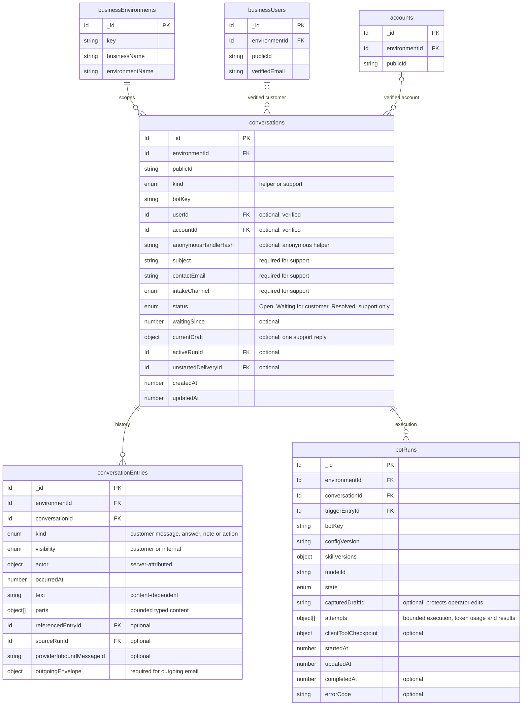
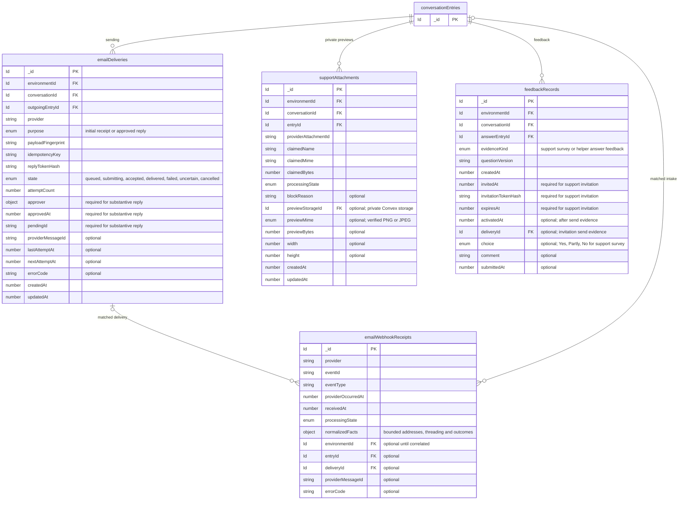
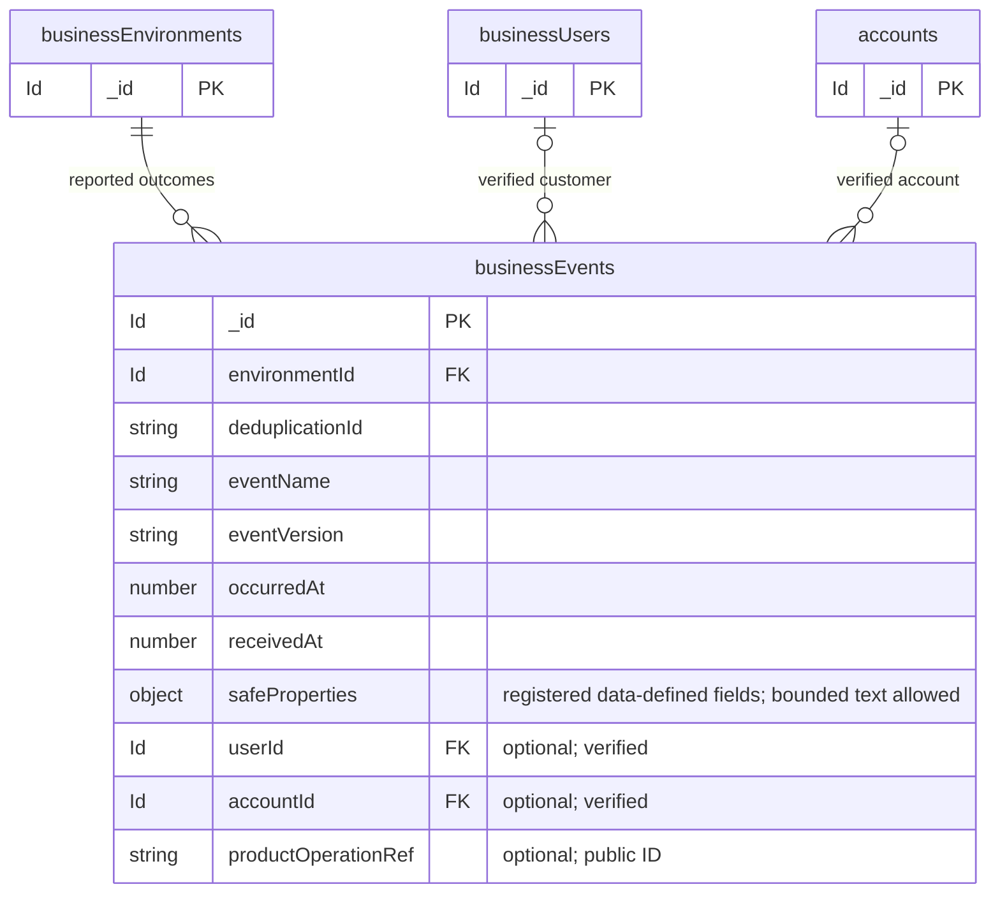
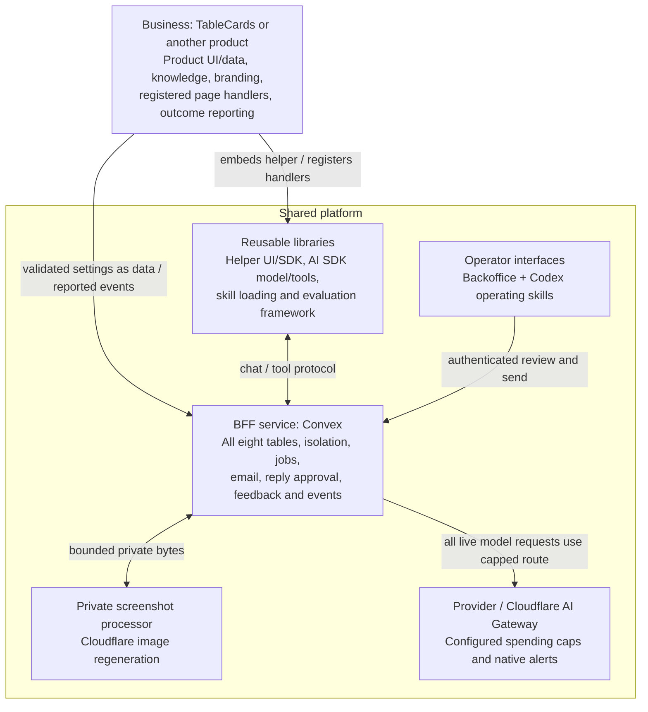

# Operator work — architecture

Created / updated: 2026-10-09 · Baseline: `7e0433c` · **Presented design/schema approved; not implemented**

Short review view of the [detailed brainstorm](../../.agent/brainstorms/261008-customer-operations-backoffice.md#proposed-erd).
Andrew approved the presented design/schema on 2026-10-09. No implementation or
deployment has started; additional unspecified structural changes are not assumed approved.

## ERD

**Eight new tables, all in shared BFF.** `businessEnvironments`, `businessUsers`
and `accounts` already exist. Identity/account and TableCards domain data are reused;
new Business configuration storage/optional fields still need structural review.
Fields below are the approved presented contracts; existing entities show only relevant fields.
`Id` means a native Convex reference; `FK` is diagram notation, not a SQL constraint.
Comments mark optional/conditional fields. Times are numeric UTC milliseconds.
Convex supplies `_id` and
`_creationTime`; the latter is omitted. Repeated boxes are the same table.

### Conversations and bot execution

### Email, attachments and feedback

### Business-reported events

The Business owns each event's name/version, property structure and display labels.
BFF validates a registered **data definition** using generic code; it does not
import Business validators. `safeProperties` may include useful bounded text;
the name is not an automatic privacy guarantee. Business-specific definitions,
bot content and mailbox settings are not yet represented by a final storage design.

Structured fields keep the diagrams compact; they are not unvalidated JSON:

| Field | Contents |
| --- | --- |
| `currentDraft` | Recipient/body, source-run ID, editor/time, exact fingerprint, pending ID/state. No draft versions. |
| `outgoingEnvelope` | Immutable from/to/reply identity, subject, text/HTML, threading headers, feedback link and any approved attachment references. |
| `attempts[]` | Attempt ID, provider/model, execution outcome, optional token usage and tool-result references. No second transcript or monetary ledger. |

- `conversations`: one helper chat **or** support ticket—not one per person.
  Support has Open / Waiting for customer / Resolved and **one current draft**.
- `conversationEntries`: the single history of messages, replies and internal
  notes. Notes stay private; there is no second agent transcript or draft-version archive.
- `botRuns`: bounded model/tool execution and diagnostic usage; no budget-period,
  per-user spending or read-approval table.
- `emailDeliveries` references one immutable approved email; webhook receipts
  deduplicate notifications. Attachments store only private regenerated-preview references;
  feedback links to the actual answer. `businessEvents` stores safe product outcomes.

Customer/account links are optional and must be verified—not inferred from email.
All child records enforce Business/environment scope. Events may also link to a
verified customer/account. Webhooks remain unlinked until safely correlated.
Relationships are application-enforced Convex references, not SQL constraints.

**Provider safety cap — selected 2026-10-09:** configure the existing $3/day and
$30/month live-text ceilings at the provider/gateway, not in application tables.
All live model traffic must use the capped route; gateway enforcement can lag
concurrent calls. At the cap, handle AI unavailability without losing tickets or
bypassing the cap. Daily/delayed native provider alerts are acceptable; no custom
budget-alert transport or backoffice spending display. Exact native alert scope
and reset windows must be checked at setup. Per-user/account/anonymous spending
attribution returns to [Future Ideas](future-ideas.md#per-user-and-per-account-provider-cost-attribution).
The former `botBudgetPeriods` proposal is removed; existing credit tables and
TableCards image safeguards remain unchanged. No settings have been configured.

## Shared versus Business

**No Business-specific code in shared service/libraries.** Shared code owns generic
machinery. Business domain rules/validators and page/backend handlers stay in the
Business deployment; knowledge, event definitions, bot instructions, branding and
approved routes can be registered as non-executable data/settings in BFF. Generic
rendering/validation consumes those settings—no hardcoded product branches.
Business-specific evaluation/seed fixtures stay with the Business; runners are shared.
Server model/tools do not run in the browser. Client requests invoke
only registered Business handlers—never generated code. Resend sends/receives mail;
BFF owns tickets. Operators see only regenerated PNG/JPEG previews, never originals.
Regeneration reduces exposure; it is not an antivirus guarantee.

**Settings still to specify:** bot/skill content and versions; event property
definitions/labels; approved page tools/destinations; support sender/recipient/reply
bindings and branding. The current environment configuration covers customer auth,
not those features. Its validated configuration flow is a precedent, not a working
registry. Registration must be authenticated; page metadata cannot grant server
permissions. Exact storage/optional fields and migration impact need review—no
ninth table or configuration console is assumed.

**Support:** automatic permitted read-only lookups → one suggested draft → operator
edits/rejects/**Send** → deterministic email delivery. Send is approval. A new customer
message invalidates unstarted send authority but preserves the draft. Fixed initial
receipts and ordinary helper answers remain automatic; no account-changing tools.

**Data impact:** eight additive empty workflow tables; no existing-data backfill.
Any new optional environment settings need a separately explained compatibility
review before schema changes. Existing identity/account data is not duplicated. TableCards
keeps projects, guest/card contents, artwork, exports and AI batches in its own
database unchanged. Cross-deployment references use public IDs, not database joins.
The presented [fields, indexes and migration safeguards](../../.agent/brainstorms/261008-customer-operations-backoffice.md#proposed-table-changes-and-indexes)
are approved. Planning still needs to specify configuration persistence and verify
the implementation; that does not reopen the settled product direction.
