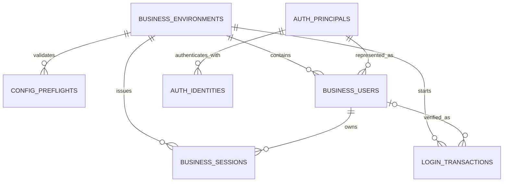
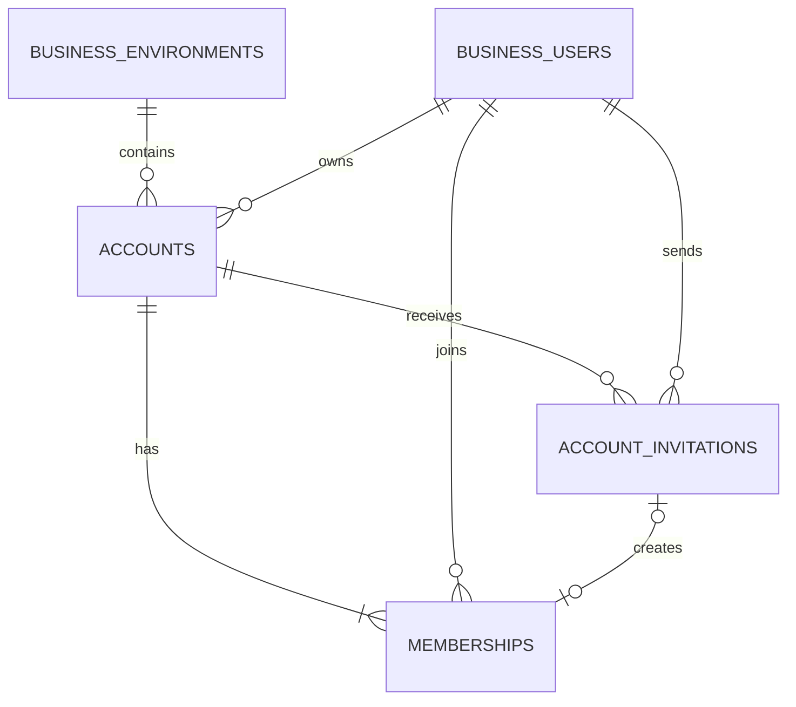
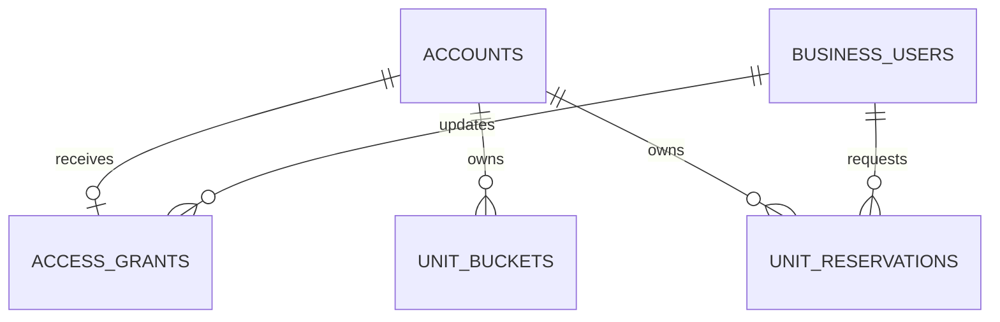
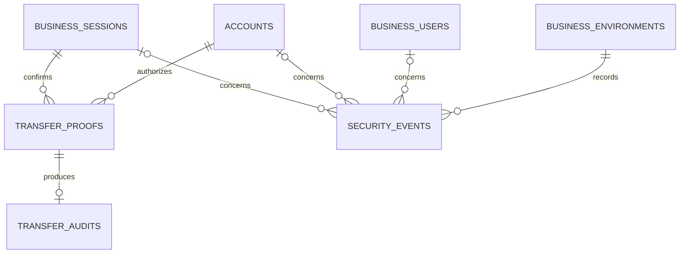

# Shared BFF Data Model

Updated: 2026-09-28.

This document explains the currently implemented shared BFF data model. The
authoritative schema remains
[`platform/bff/service/convex/schema.ts`](../../platform/bff/service/convex/schema.ts).
This reference explains why each table exists and how the records relate; it
does not replace the schema, public contracts or accepted ADRs.

Every Convex document also has the implicit `_id` and `_creationTime` fields.
Indexes accelerate and bound access paths but are not SQL-style unique or
foreign-key constraints. BFF mutations preserve the stated invariants
transactionally.

## Mental model

```text
External identity → auth principal → Business-local user → session
                                                   │
                                                   ▼
                              membership → account → product access → units
```

An external login identity is not a Business user, a user is not an account,
an account role is not a product entitlement, and an entitlement is not a
mutable unit balance. Keeping those concepts separate prevents authentication,
administration and billing from accidentally granting one another.

## Identity, environment and session relationships



### `businessEnvironments`

The root record for one Business in one deployment environment, such as
TableCards development or TableCards production. It stores the active customer
authentication configuration, account-policy defaults and configuration
revisions. Customer data beneath this root is environment-scoped.

### `customerConfigurationPreflights`

A temporary compare-and-apply safety record created before changing a Business
configuration. It contains the complete proposed configuration, the revisions
the caller expects to replace and any compatibility conflicts. It expires and
can be consumed only once, preventing a stale preview from overwriting a newer
configuration. The active configuration remains on `businessEnvironments`.

### `authPrincipals`

The minimal, private, provider-independent identity for a person. A principal
survives provider changes and intentionally carries no Business profile. It can
later connect Google, Apple or another proven identity without changing the
person's Business-local IDs.

### `authIdentities`

Maps one external provider identity, identified by provider plus issuer and
subject, to an `authPrincipal`. Email is not an identity key and never causes
automatic account merging. One principal may eventually have multiple proven
provider identities.

### `businessUsers`

Represents an authenticated principal inside one Business environment. It owns
the public user ID and the Business-facing profile: verified email, display
name and optional picture. The same principal receives distinct Business-user
records in different Businesses and in development versus production. Cached
membership and ownership counts support transactional limit enforcement.

### `loginTransactions`

A short-lived state machine for one login or ownership-transfer
reauthentication attempt. It binds the Business environment, callback, browser
state, PKCE challenge, provider nonce and single-use handoff code. Optional
transfer binding restricts reauthentication to one session, account and target
membership. This table prevents attempts, tabs, callbacks and Businesses from
being mixed; it is not a logged-in session.

### `businessSessions`

The durable server-side browser session behind the Business-owned HttpOnly
cookie. The cookie contains an opaque handle and BFF stores only its hash.
Idle/absolute expiry and revocation live here. A session identifies the user,
but deliberately does not choose an account: each browser tab receives its own
short-lived account-scoped JWT.

## Account relationships



### `accounts`

The workspace and commercial container. An account owns memberships, product
access and units, and will own subscription state when real billing is added.
It is not a person and has no structural personal/team/organization kind: the
same account can move from a single-user offer to a team offer without changing
its identity or product data. It stores its current owner, bounded policy
overrides and cached active-member/pending-invitation counts.

### `memberships`

The authoritative relationship granting one `businessUser` access to one
account, with the fixed role `owner`, `admin` or `member`. Role controls account
administration; it does not imply paid product capabilities. The account's
Owner also has an Owner membership, and transfer logic keeps that membership
consistent with `accounts.ownerUserId`.

### `accountInvitations`

The lifecycle of an email-bound invitation to join an account: pending,
accepted, revoked or expired. It stores only a token hash, reserves membership
capacity while pending and records the accepted user and membership when the
recipient joins. Invitations do not themselves authenticate a person.

## Product access and unit relationships



### `accountAccessGrants`

The account's current effective product-access projection: an offer key and
revision, feature flags, numeric limits and unit-allocation policies. In Build
3 the development commerce mock is its only writer. Monthly mock allocations
are anchored to activation and BFF resolves the effective billing cycle; fixed
allocations cover lifetime and event grants. It is not a payment transaction,
subscription history or registered plan definition. Real billing can later
derive the same provider-neutral projection from verified provider state.

### `accountUnitBuckets`

The authoritative aggregate balance for one account, unit type and allocation.
The implemented internal field is still named `periodKey`, but its value may
identify a billing cycle, lifetime grant or event rather than a calendar
period. A bucket records allowance, currently reserved units and committed
consumption. BFF creates it lazily on the first reservation against that
allocation, and prior buckets remain as usage history. Mutable balances do not
enter the short-lived account JWT.

### `accountUnitReservations`

An idempotent claim against a unit bucket for one operation. The Business asks
to reserve a unit type and amount; it does not provide a period/allocation key.
BFF resolves the effective allocation and records that choice on the
reservation. Work reserves before calling a provider, commits after success,
and releases on failure; abandoned reservations can expire. This prevents
retries, concurrent requests and failed generation from double-spending or
losing units. The public reservation ID is the safe cross-deployment reference
used by a Business such as TableCards.

## Ownership-transfer and security evidence



### `ownershipTransferProofs`

A short-lived, single-use authorization proving that the current Owner
recently reauthenticated for one exact transfer. It is bound to the session,
account, current Owner membership and intended new Owner membership. It cannot
authorize another transfer or be replayed after consumption.

### `ownershipTransferAudits`

Permanent, denormalized evidence of a completed ownership transfer, including
the previous and new users/memberships and the account, session and proof
identifiers. It remains after the temporary proof is cleaned up because an
authorization artifact and lasting audit evidence have different lifecycles.

### `securityEvents`

A bounded operational record for meaningful security events such as login,
logout, session revocation, ownership transfer and development automation use.
Correlation IDs support investigation without storing tokens or raw
credentials. Expected denials and request floods are not individually recorded.
The dedicated ownership-transfer audit is more detailed and permanent than
this general event stream.

## Current intentional omissions

The shared schema currently has no payment transactions, subscription records,
Paddle webhook records, registered plan definitions, per-member premium seat
assignments, support conversations or product analytics events. Those tables
are added only in the build that supplies their first real writer and reader.
Build 3's access grant is an effective development access projection, not a
pretend billing implementation.

Business product records live in the Business's own deployment. TableCards,
for example, stores BFF `accounts.publicId` and `businessUsers.publicId` as
validated cross-deployment strings rather than native Convex foreign keys.
