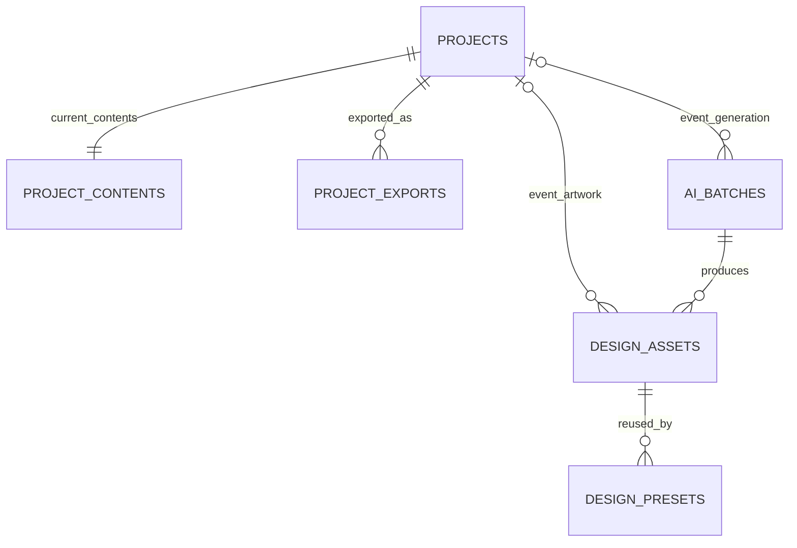

# TableCards architecture and data model

Created: 2026-10-06
Updated: 2026-10-06
Baseline: runtime source at `b5aeae3` on `feat/tablecards-application`; documentation reconciled after checkpoint `42a6e33`
Scope: implemented Build 3 development architecture, not production approval

The [product](product.md) defines promises; the [application contract](application.md)
defines how people use them. This document explains the implementation and its
ownership boundaries. The [schema](../backend/convex/schema.ts) and public
function validators remain the exact executable definitions.

## Components and ownership

```text
Browser / TableCards React app
  ├─ same-site session gateway → TableCards server SDK → shared BFF auth
  ├─ account-context JWT → native TableCards Convex product functions
  └─ account-context JWT → BFF SDK account/team operations

TableCards backend
  ├─ TableCards database + Convex file storage: projects, artwork, jobs
  ├─ BFF server SDK: effective access, units and checkout creation
  └─ core library: validation, print layout and PDF rendering
```

The gateway handles only the fixed SDK authentication/session routes. Product
queries, mutations, subscriptions and actions use native Convex directly. The
shared BFF owns identities, sessions, accounts, memberships, invitations,
roles, effective product access and unit allocations. TableCards owns its
product data; it does not replicate those shared tables.

See [shared BFF table explanations](../../../docs/architecture/shared-bff-data-model.md),
[SDK exports and contracts](../../../platform/bff/libs/sdk/typescript/README.md)
and [ADR 0004](../../../docs/architecture/adr/0004-business-customer-auth-and-accounts.md).

### Authentication and context

The browser shares one durable HttpOnly opaque session cookie across tabs;
it does not encode the selected account. The Business server SDK calls BFF to
obtain one short-lived, BFF-signed current-context JWT for each tab. The same
token authenticates TableCards and permitted shared BFF calls. The browser
never receives the renewal handle through JavaScript or signs its own token.

TableCards guards derive `accountId` and `userId` from verified BFF context.
Public route IDs do not establish authorization. Account selection clears the
old SDK context. Returning from a saved-project route to Projects is intended,
but the [hands-on review](reviews/261006-tablecards-app-review.md)
observed the old route retained with an empty editor after the switch. No
stale guest disclosure was observed; this is a navigation/state defect. The
same-site Cloudflare gateway avoids the generated-domain cross-site cookie
topology without becoming a session database or product proxy.

Stable behavior and login presentation live in
[customer-auth.defaults.ts](../customer-auth.defaults.ts). Origins, deployment
URLs and development automation trust are deployment configuration. Current
defaults permit two memberships and two owned accounts so a private workspace
can coexist with an invited Studio workspace and receive its ownership.
Ordinary user-created extra accounts remain disabled. Studio checkout applies
the offer's five-seat, invitation and Admin policy through BFF atomically.

## Product tables

All six tables carry account scope. `accountId` and user fields are public BFF
identifiers, not foreign keys into the independent BFF database. Convex `_id`
references relate records inside this TableCards deployment. Indexes support
lookups; transactional functions enforce invariants rather than relying on SQL
foreign-key or unique constraints.

| Table             | Purpose and main relationships                                                                                              | Why separate                                                                                              |
| ----------------- | --------------------------------------------------------------------------------------------------------------------------- | --------------------------------------------------------------------------------------------------------- |
| `projects`        | Event metadata: public ID, account, creator, title, active/archived state, design reference/style, guest count and revision | Project lists need summaries, not every guest row                                                         |
| `projectContents` | The project's current ordered guest array and revision, linked by `projectId`                                               | Keeps private list content separate from lightweight summaries; this is not an immutable revision history |
| `designAssets`    | Validated uploaded/generated PNG/JPEG metadata and a Convex storage ID; optional `projectId` for event-scoped artwork       | Stores the file once and distinguishes event-only from reusable artwork                                   |
| `designPresets`   | Account-owned reusable style pointing to `designAssets`, with name and constrained text styling                             | A preset is a reusable choice, not the underlying image or a freeform canvas                              |
| `projectExports`  | Export request/result linked to a project and its requested revision/layout; status, file ID, page count or safe error      | Tracks asynchronous PDF work separately from editable projects                                            |
| `aiBatches`       | Account/idempotency-keyed generation operation, optional project, prompt, status, reservation reference and four asset IDs  | Retries must not duplicate generation or consume another BFF unit                                         |

Convex `_storage` holds image/PDF bytes; it is not a custom product table.
Database rows store storage IDs, not permanently cached download URLs. Queries
obtain current URLs when needed; possession of a file URL must be treated as
access to that file, not a replacement for account authorization.

These `getUrl` URLs do not automatically expire and remain usable after
membership/session changes while the file exists. The earlier runbook claim
that they were short-lived was incorrect. See the official
[file security model](https://docs.convex.dev/file-storage/overview); release
review must explicitly resolve private PDF access and revocation expectations.



Projects reference predefined catalog IDs or account-owned asset public IDs;
this is a validated polymorphic design reference rather than one foreign key.
Selecting a preset copies its text style into the project, so later preset
edits do not silently change the project's next PDF. Saved contents preserve
guest order, duplicate names and spelling.

## Customer API map

These are Convex function names, not invented REST endpoints. The browser
adapter is [web/src/backend.ts](../workloads/web/src/backend.ts). Protected
queries/mutations use native authenticated Convex context; actions also accept
the current token for verified server-to-server BFF operations. Internal
`*Authorized` functions are not public authorization shortcuts.

| Capability                  | Public function(s)                                                                 | Boundary/result                                                                                     |
| --------------------------- | ---------------------------------------------------------------------------------- | --------------------------------------------------------------------------------------------------- |
| Current account offer/units | `productAccess:current`                                                            | BFF effective access and current balance; UI gets an allocation label, not a bucket selector        |
| Start purchase simulation   | `productAccess:startCheckout`                                                      | Owner context plus backend-only service credential; returns provider-neutral checkout URL           |
| List/open/archive projects  | `projects:list`, `projects:get`, `projects:archive`                                | Verified account scope; summaries or current contents                                               |
| Save/duplicate/restore      | `productAccess:saveProject`, `duplicateProject`, `restoreProject`                  | Current offer checks, then transactional project update/capacity enforcement                        |
| Upload artwork              | `assets:generateUploadUrl`, `assets:finalize`, `assets:list`                       | Entitlement check, storage upload, byte/type/dimension validation and account/project attachment    |
| Reusable presets            | `designPresets:list`; `productAccess:createPreset`, `updatePreset`, `deletePreset` | Reuse entitlement and account-scoped asset/style validation                                         |
| Generate backgrounds        | `ai:generate`, `aiState:get`                                                       | Reserve one batch unit; exactly four choices or a safe failure                                      |
| Export/download             | `exports:request`, `exportState:get`, `exportState:latestForProject`               | Current offer and project checks; queued → generating → ready/failed, with file URL only when ready |
| Sessions, accounts, teams   | Public BFF browser/React SDK                                                       | BFF-authorized invitations, roles, removal and provider-neutral ownership transfer                  |

The TableCards HTTP router mounts SDK session endpoints and `/v1/health`.
Health reports service/version and no customer data. Generic product and team
APIs belong to BFF or native Convex, not extra TableCards HTTP copies.

## Important operation flows

### Save and PDF export

1. Browser parses pasted/grid/CSV/XLSX rows and presents mapping/validation.
2. Save rechecks current offer, account-scoped design and limits server-side;
   an internal transaction stores project metadata and current contents.
3. Export request records the project revision/layout and schedules rendering.
   An existing non-failed request for that revision/layout can be reused.
4. Renderer loads the project, verifies predefined artwork bytes against the
   catalog hash or loads the validated custom asset, then renders/stores PDF.
5. UI observes ready/failed status and offers a successful download, not a
   pretend export success.

The current implementation does not bind rendering to an immutable contents
snapshot: `exportState:load` reads current project/contents without checking the
recorded `projectRevision`. Concurrent edits can therefore render a different
revision. Separately, the browser reuses `savedProject` when the draft is dirty,
so the displayed preview and requested export can disagree. Both are defects,
not the intended revision contract.

The canonical physical contract is four folded cards on US Letter. The
six-card landscape option is a development print trial. Shared core geometry
and versioned artwork align browser preview with deterministic PDF output.
White `v2` print artwork avoids a full-page tint while the site retains a warm
visual palette. Current hosted font coverage uses built-in Helvetica; broad
Unicode coverage must not be promised without reviewed bundled font bytes.

### AI usage and payment boundary

TableCards asks BFF to reserve `ai_background_batch`, amount `1`, and an
idempotency key. It never chooses a bucket or billing period. BFF resolves a
fixed lifetime/event allocation or the current monthly anniversary cycle and
creates a missing bucket lazily. Old consumption stays in its original bucket.
Generation commits on success and attempts release on failure; reservation
expiry is a fallback when release cannot reach BFF. Generation only passes the
background prompt, not project guest rows, to the image provider.

This crosses two independent services, not one distributed transaction.
Interruption between committing a BFF unit and recording completed product
assets is a reconciliation concern; the normal provider-failure test alone
does not prove recovery from every such interruption.

Build 3 uses a deterministic image provider and shared no-charge checkout.
TableCards redirects to the URL returned by BFF; it has no local payment mock
screen. Checkout completion applies grant and compatible account policy in
one BFF transaction. Monthly mock renewal simulates success automatically.
It is not evidence that a real payment succeeded. Build 4 must derive access
and next-cycle allowances only from verified provider paid-through state.

## Consistency and evidence

The 2026-10-06 independent readiness review also found an authorization defect
in [upload finalization](../backend/convex/assets.ts): the caller-supplied
storage ID is not bound to that caller's upload/account, and failed finalization
deletes it without proving ownership. Account-scoped asset rows do not establish
ownership of arbitrary storage bytes. Existing upload validation should not be
read as proof that this boundary is safe; remediation needs negative ownership
and cleanup tests. See the dated [reviews](reviews/) for reproduction scope and
severity.

Before changing a table or public function, reconcile this explanation with
the executable schema/validators, browser adapter and affected tests. Before
changing an offer, reconcile product copy, catalog, BFF grant/policy, visible
workflow and negative entitlement tests. Keep generic BFF explanations in
their shared document and link them here.

The [operations runbook](operations.md) supplies commands and environments;
dated [reviews](reviews/) record what was actually checked and what remains
unverified. Documentation cannot turn a development pass into production or
customer-launch acceptance.
