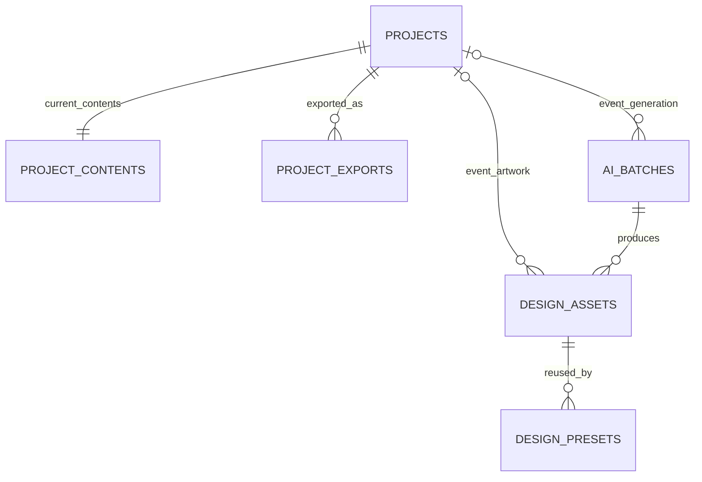

# TableCards architecture and data model

Created: 2026-10-06
Updated: 2026-10-06
Baseline: review checkpoint `3a948ad` on `feat/tablecards-application`, followed by the 2026-10-06 remediation implementation; deployed verification is recorded in dated reviews
Scope: implemented Build 3 development architecture, not production approval

The [product](product.md) defines promises; the [application contract](application.md)
defines how people use them. This document explains the implementation and its
ownership boundaries. The [schema](../backend/convex/schema.ts) and public
function validators remain the exact executable definitions.

## Components and ownership

```text
Browser / TableCards React app
  ├─ same-site session gateway → TableCards server SDK → shared BFF auth
  ├─ account-context JWT → native TableCards Convex product functions
  ├─ account-context JWT → authenticated TableCards private-file HTTP actions
  └─ account-context JWT → BFF SDK account/team operations

TableCards backend
  ├─ TableCards database + Convex file storage: projects, artwork, jobs
  ├─ BFF server SDK: effective access, units and checkout creation
  └─ core library: validation, print layout and PDF rendering
```

The gateway handles only the fixed SDK authentication/session routes. Product
queries, mutations, subscriptions and actions use native Convex directly. The
shared BFF owns identities, sessions, accounts, memberships, invitations,
roles, effective product access and unit allocations. TableCards owns its
product data; it does not replicate those shared tables.

See [shared BFF table explanations](../../../docs/architecture/shared-bff-data-model.md),
[SDK exports and contracts](../../../platform/bff/libs/sdk/typescript/README.md)
and [ADR 0004](../../../docs/architecture/adr/0004-business-customer-auth-and-accounts.md).

### Authentication and context

The browser shares one durable HttpOnly opaque session cookie across tabs;
it does not encode the selected account. The Business server SDK calls BFF to
obtain one short-lived, BFF-signed current-context JWT for each tab. The same
token authenticates TableCards and permitted shared BFF calls. The browser
never receives the renewal handle through JavaScript or signs its own token.

TableCards guards derive `accountId` and `userId` from verified BFF context.
Public route IDs do not establish authorization. Account selection clears the
old SDK context and private-file Blob cache. Account-change navigation lives
outside the provider's keyed remount boundary so a saved-project switch can
return to Projects rather than leave the previous account's route behind. The
same-site Cloudflare gateway avoids the generated-domain cross-site cookie
topology without becoming a session database or product proxy.

Owner workspace naming is a same-account metadata refresh: it preserves the
authenticated provider context and page feedback rather than performing an
account switch. Captured session-generation guards prevent late rename results
from restoring an old account after a switch or sign-out.

Stable behavior and login presentation live in
[customer-auth.defaults.ts](../customer-auth.defaults.ts). Origins, deployment
URLs and development automation trust are deployment configuration. Current
defaults permit two memberships and two owned accounts so a private workspace
can coexist with an invited Studio workspace and receive its ownership.
Ordinary user-created extra accounts remain disabled. Studio checkout applies
the offer's five-seat, invitation and Admin policy through BFF atomically.

## Product tables

All six tables carry account scope. `accountId` and user fields are public BFF
identifiers, not foreign keys into the independent BFF database. Convex `_id`
references relate records inside this TableCards deployment. Indexes support
lookups; transactional functions enforce invariants rather than relying on SQL
foreign-key or unique constraints.

| Table             | Purpose and main relationships                                                                                                                 | Why separate                                                                                              |
| ----------------- | ---------------------------------------------------------------------------------------------------------------------------------------------- | --------------------------------------------------------------------------------------------------------- |
| `projects`        | Event metadata: public ID, account, creator, title, active/archived state, design reference/style, guest count and revision                    | Project lists need summaries, not every guest row                                                         |
| `projectContents` | The project's current ordered guest array and revision, linked by `projectId`                                                                  | Keeps private list content separate from lightweight summaries; this is not an immutable revision history |
| `designAssets`    | Validated uploaded/generated PNG/JPEG metadata and a Convex storage ID; optional `projectId` for event-scoped artwork                          | Stores the file once and distinguishes event-only from reusable artwork                                   |
| `designPresets`   | Account-owned reusable style pointing to `designAssets`, with name and constrained text styling                                                | A preset is a reusable choice, not the underlying image or a freeform canvas                              |
| `projectExports`  | Export request/result with requested revision/layout and atomically captured render snapshot; status, file ID, page count or safe error        | Queued work must not silently read a newer editable project                                               |
| `aiBatches`       | Account/idempotency-keyed operation, prompt, reservation, durable generated-file descriptors, commit confirmation and four completed asset IDs | Interrupted completion can resume without deleting charged results or consuming another unit              |

Convex `_storage` holds image/PDF bytes; it is not a custom product table.
Database rows store storage IDs. Customer projections return relative private
file addresses, never new `storage.getUrl` bearer links. Every byte request
verifies the account token, exact Origin where applicable, current BFF
membership and active session before reading storage. The browser materializes
bounded Blob URLs and revokes its cache on account/session changes and disposal.
Already delivered/downloaded bytes cannot be recalled. Older development
bearer links remain usable while their files exist; no destructive file
migration was performed. This residual limitation is explicitly disclosed.

Artwork libraries use account-indexed, 24-item metadata cursor pages through
`assets:page` and `designPresets:page`, loaded explicitly as needed. Assets are
ordered newest-created first; presets newest-updated first. Existing bounded
`list` functions remain for Creator compatibility, but are not the Designs
library's completeness boundary. Visible thumbnails and the selected design
acquire browser byte references through `resolveArtwork`; leaving view releases
them, allowing inactive cached bytes to be evicted without breaking active
previews. `assets:get` resolves the exact account-owned current selection even
when it falls outside the library list's bounded window.



Projects reference predefined catalog IDs or account-owned asset public IDs;
this is a validated polymorphic design reference rather than one foreign key.
Selecting a preset copies its text style into the project, so later preset
edits do not silently change the project's next PDF. Saved contents preserve
guest order, duplicate names and spelling.

## Customer API map

These are Convex function names, not invented REST endpoints. The browser
adapter is [web/src/backend.ts](../workloads/web/src/backend.ts). Protected
queries/mutations use native authenticated Convex context; actions also accept
the current token for verified server-to-server BFF operations. Internal
`*Authorized` functions are not public authorization shortcuts.

| Capability                  | Public function(s)                                                                                       | Boundary/result                                                                                                                                                                                                                                                                        |
| --------------------------- | -------------------------------------------------------------------------------------------------------- | -------------------------------------------------------------------------------------------------------------------------------------------------------------------------------------------------------------------------------------------------------------------------------------- |
| Current account offer/units | `productAccess:current`                                                                                  | BFF effective access and current balance; UI gets an allocation label, not a bucket selector                                                                                                                                                                                           |
| Start purchase simulation   | `productAccess:startCheckout`                                                                            | Owner context plus backend-only service credential; returns provider-neutral checkout URL                                                                                                                                                                                              |
| List/open/archive projects  | `projects:list`, `projects:page`, `projects:get`, `projects:archive`                                     | Verified account/state index; paginated 24-row summaries keep growing archives discoverable. The bounded active list remains available for accurate offer-capacity counts; get returns current scoped contents                                                                         |
| Save/duplicate/restore      | `productAccess:saveProject`, `duplicateProject`, `restoreProject`                                        | Current offer checks, then transactional project update/capacity enforcement                                                                                                                                                                                                           |
| Upload/artwork library      | `POST /v1/files/artwork?projectId=...`; `assets:list`, `assets:get`, `assets:page`                       | Bounded authenticated PNG/JPEG bytes; server-created storage only, current offer and scope validation. Metadata pages cover growing libraries; exact account-scoped lookup resolves current selections beyond the compatibility list. Legacy upload URL/finalize functions fail closed |
| Private file delivery       | `GET /v1/files/assets/:publicId`, `GET /v1/files/exports/:publicId`                                      | Authoritative session/membership and scoped row lookup on each request; no token in URL                                                                                                                                                                                                |
| Reusable presets            | `designPresets:list`, `designPresets:page`; `productAccess:createPreset`, `updatePreset`, `deletePreset` | Account-indexed metadata pages; reuse entitlement and account-scoped asset/style validation                                                                                                                                                                                            |
| Generate backgrounds        | `ai:generate`, `aiState:get`                                                                             | Reserve one batch unit; exactly four choices or a safe failure                                                                                                                                                                                                                         |
| Export/download             | `exports:request`, `exportState:get`, `exportState:latestForProject`                                     | Current offer and project checks; queued → generating → ready/failed, with file URL only when ready                                                                                                                                                                                    |
| Sessions, accounts, teams   | Public BFF browser/React SDK                                                                             | BFF-authorized invitations, roles, removal, Owner-only workspace naming and provider-neutral ownership transfer                                                                                                                                                                        |

The TableCards HTTP router mounts SDK session endpoints, private file transfer
and `/v1/health`.
Health reports service/version and no customer data. Generic product and team
APIs belong to BFF or native Convex, not extra TableCards HTTP copies.

## Important operation flows

### Save and PDF export

1. Browser parses pasted/grid/CSV/XLSX rows and presents mapping/validation.
2. Save rechecks current offer, account-scoped design and limits server-side;
   an internal transaction stores project metadata and current contents.
3. Export request atomically captures the authorized revision, guest contents,
   title, style and artwork reference and schedules rendering in the same
   mutation; a scheduling failure rolls back the job instead of orphaning it.
   An existing non-failed request for that revision/layout can be reused.
4. Renderer loads that snapshot, verifies predefined artwork and bundled Noto
   fonts against approved hashes, then renders/stores PDF. Legacy jobs without
   a snapshot reject mismatched live revisions rather than relabel their PDF.
5. UI observes ready/failed status and offers a successful download, not a
   pretend export success.

The browser parses/saves current edits before export and hides stale download
links when the draft changes. Latest-export queries omit a result from an older
project revision. Snapshot/save/load interleaving and actual PDF contents are
regression boundaries, not merely export status assertions.

The canonical physical contract is four folded cards on US Letter. The
six-card landscape option is a development print trial. Shared core geometry
and versioned artwork align browser preview with deterministic PDF output.
White `v2` print artwork avoids a full-page tint while the site retains a warm
visual palette. Hosted exports embed pinned Noto Sans and Noto Serif. Unsupported
glyphs and impossible fits remain explicit failures; this is a Latin-script
contract, not an assertion that every writing system is supported.
Browser preflight uses generated advances from those same hash-pinned fonts,
including distinct serif metrics and the current event title; the core test
regenerates/checks the metrics. SVG and PDF both disable kerning and discretionary
ligatures and render canonical-equivalent NFC text without changing stored
names. Common Latin (including Vietnamese) and supported punctuation are
accepted; remaining combining marks fail preflight instead of entering unsafe
font shaping. The server applies the same boundary before drawing any text.

### AI usage and payment boundary

TableCards asks BFF to reserve `ai_background_batch`, amount `1`, and an
idempotency key. It never chooses a bucket or billing period. BFF resolves a
fixed lifetime/event allocation or the current monthly anniversary cycle and
creates a missing bucket lazily. Old consumption stays in its original bucket.
Generation persists four private output descriptors before committing a unit,
records confirmed commit, and atomically attaches the ready choices. A lost
commit/completion response preserves outputs and permits the same original
requester's idempotency key to reconcile completion. The authorized
`aiState:pendingForCaller` query restores that key after reload for the same
account, requester and optional saved event, even when the unit balance is zero;
it never exposes storage identifiers. Provider failure before
persisted outputs attempts release; reservation expiry is a fallback when
release cannot reach BFF. Generation only passes the
background prompt, not project guest rows, to the image provider.

Uploaded artwork is fully decoded before storage: exact unrotated 7:4 ratio,
minimum 1050 × 600 pixels, at most 2 megapixels and 10 MiB; PNG is non-animated,
8-bit or lower. Streaming IDAT/profile expansion bounds and a 32 MiB JPEG decoder
budget protect the Convex HTTP runtime, not just the compressed request size.

This crosses two independent services, not one distributed transaction.
Recovery tests interrupt descriptor persistence, BFF commit and product
completion, including responses lost after remote success. Retries must yield
the same four assets and one charge. Pending outputs are not visible as ready.

Build 3 uses a deterministic image provider and shared no-charge checkout.
TableCards redirects to the URL returned by BFF; it has no local payment mock
screen. Checkout completion applies grant and compatible account policy in
one BFF transaction. Monthly mock renewal simulates success automatically.
It is not evidence that a real payment succeeded. Build 4 must derive access
and next-cycle allowances only from verified provider paid-through state.

## Consistency and evidence

The initial 2026-10-06 review is preserved as a failed baseline. Its upload,
export and AI findings drove the current implementation; the remediation review
records fresh verification separately. Never infer storage ownership from a
caller-supplied ID. Upload cleanup may delete only this handler's unlinked
server-created file, and must preserve a file whose attachment response was lost.

Before changing a table or public function, reconcile this explanation with
the executable schema/validators, browser adapter and affected tests. Before
changing an offer, reconcile product copy, catalog, BFF grant/policy, visible
workflow and negative entitlement tests. Keep generic BFF explanations in
their shared document and link them here.

The [operations runbook](operations.md) supplies commands and environments;
dated [reviews](reviews/) record what was actually checked and what remains
unverified. Documentation cannot turn a development pass into production or
customer-launch acceptance.
